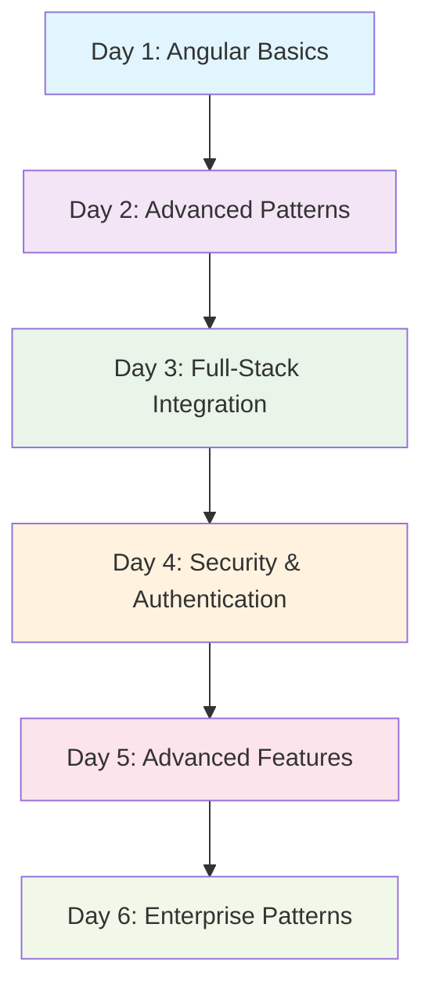
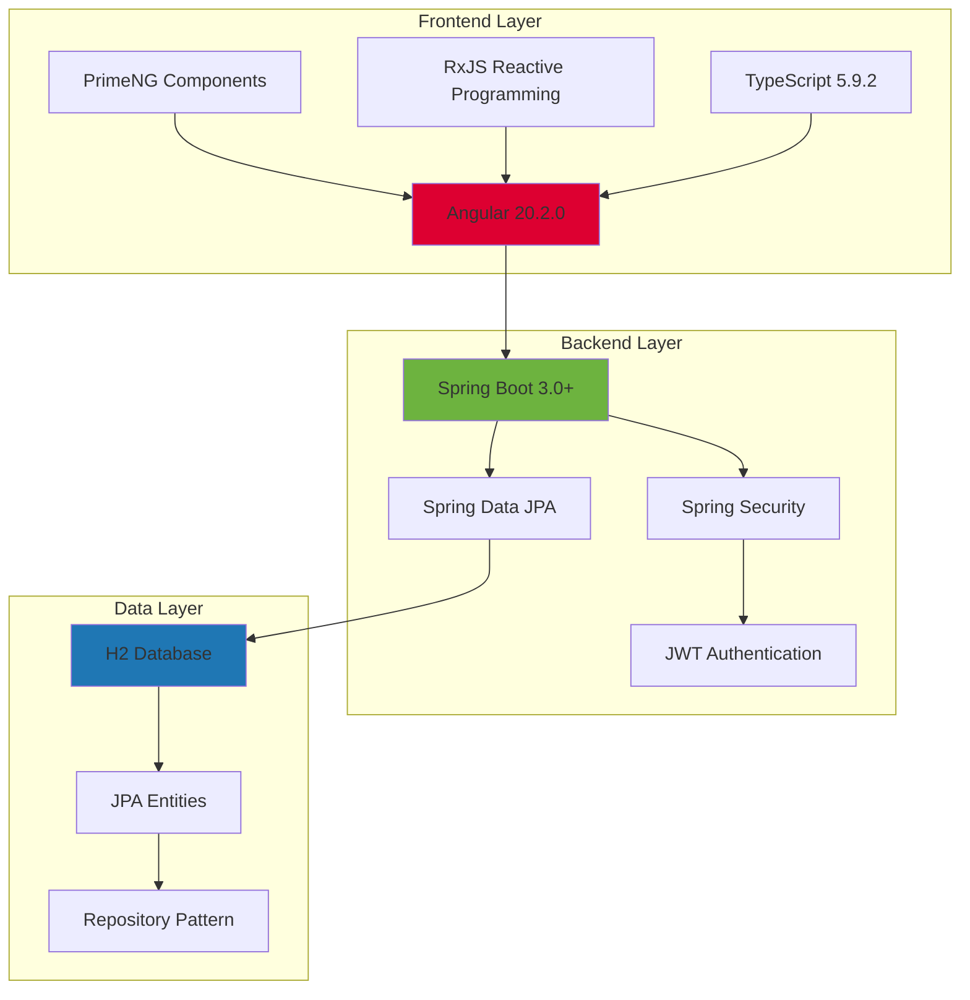

# 🚀 Phase 1: Angular Foundation to Full-Stack Mastery

<div align="center">


**🎯 A comprehensive journey from Angular basics to enterprise-level full-stack applications**

</div>

---

## 📚 Learning Path Overview

Phase 1 represents a structured progression through Angular development, from fundamental concepts to advanced full-stack implementations with Spring Boot integration.

<div align="center">



</div>

---

## 🎨 Project Showcase

### 🌟 Day 1: Foundation Bug Tracker
<div align="left">


</div>

**🎯 Learning Focus:** Angular fundamentals, component architecture, basic routing

**✨ Key Features:**
- 📝 Basic CRUD operations for bug management
- 🧭 Angular routing and navigation
- 🎨 Bootstrap styling and responsive design
- 📋 Form handling and validation
- 🔄 Component communication

**🛠️ Tech Stack:**
- Angular 20.2.0
- TypeScript 5.9.2
- Bootstrap CSS
- RxJS for reactive programming

---

### 🚀 Day 2: Advanced Bug Tracker
<div align="left">


</div>

**🎯 Learning Focus:** Advanced Angular patterns, reactive programming, state management

**✨ Key Features:**
- 🔄 Reactive forms with complex validation
- 🛡️ Route guards and authentication simulation
- 📊 Advanced data filtering and sorting
- 🎭 Custom pipes and directives
- 🔍 Search functionality with debouncing
- 📱 Enhanced mobile responsiveness

**🛠️ Tech Stack:**
- Angular 20.2.0 with advanced features
- RxJS operators and observables
- Reactive Forms API
- Custom Angular services

---

### 🏗️ Day 3: Full-Stack Integration
<div align="left">


</div>

**🎯 Learning Focus:** Full-stack development, REST API integration, database operations

**✨ Frontend Features:**
- 🌐 HTTP client integration with Spring Boot backend
- 📡 Real-time API communication
- 🔄 Loading states and error handling
- 📊 Dynamic data visualization
- 🎨 Enhanced UI with better UX patterns

**✨ Backend Features:**
- 🚀 Spring Boot REST API
- 🗄️ H2 in-memory database
- 📝 JPA/Hibernate for data persistence
- 🔧 CORS configuration for frontend integration
- 📋 Comprehensive CRUD operations

**🛠️ Tech Stack:**
- **Frontend:** Angular 20.2.0, HttpClient, RxJS
- **Backend:** Spring Boot 3.0+, Spring Data JPA, H2 Database
- **Integration:** RESTful APIs, JSON data exchange

---

### 🔐 Day 4: Secure Bug Tracker
<div align="left">


</div>

**🎯 Learning Focus:** Security implementation, JWT authentication, user management

**✨ Frontend Features:**
- 🔐 JWT-based authentication system
- 👤 User registration and login flows
- 🛡️ Protected routes with auth guards
- 🎨 PrimeNG component integration
- 📱 Modern, responsive UI design
- 🔄 Token management and refresh

**✨ Backend Features:**
- 🔒 Spring Security configuration
- 🎫 JWT token generation and validation
- 👥 User management with roles (ADMIN, USER, DEVELOPER)
- 🔐 Password encryption with BCrypt
- 🛡️ Method-level security annotations
- 📊 Role-based access control

**🛠️ Tech Stack:**
- **Frontend:** Angular 20.2.0, PrimeNG 17.18.9, JWT handling
- **Backend:** Spring Boot 3.0+, Spring Security, JWT, BCrypt
- **Database:** H2 with user and bug entities
- **Security:** JWT tokens, role-based authorization

---

### 🌟 Day 5: Advanced Enterprise Features
<div align="left">


</div>

**🎯 Learning Focus:** Enterprise patterns, advanced UI components, performance optimization

**✨ Advanced Features:**
- 📊 Advanced data tables with sorting, filtering, and pagination
- 📈 Real-time dashboards and analytics
- 🔍 Advanced search with multiple criteria
- 📁 File upload and management
- 🔔 Real-time notifications
- 📱 Progressive Web App (PWA) features
- 🎨 Advanced PrimeNG component usage

**🛠️ Tech Stack:**
- **Frontend:** Angular 20.2.0, PrimeNG 17.18.9, PWA features
- **Backend:** Spring Boot with advanced features
- **Performance:** Lazy loading, OnPush change detection
- **Real-time:** WebSocket integration

---

### 🏢 Day 6: Enterprise Architecture
<div align="left">


</div>

**🎯 Learning Focus:** Enterprise architecture, scalability, production-ready patterns

**✨ Enterprise Features:**
- 🏗️ Modular architecture with feature modules
- 🔄 State management patterns
- 🧪 Comprehensive testing strategies
- 📦 Build optimization and deployment
- 🔍 Advanced error handling and logging
- 📊 Performance monitoring and analytics
- 🛡️ Advanced security patterns

**🛠️ Tech Stack:**
- **Frontend:** Angular 20.2.0 with enterprise patterns
- **Backend:** Spring Boot with microservice patterns
- **Testing:** Jasmine, Karma, comprehensive test coverage
- **Deployment:** Production-ready build configurations

---

## 🛠️ Technical Architecture

<div align="center">



</div>

---

## 🚀 Getting Started

### Prerequisites
- **Node.js** 18+ and npm
- **Java** 17+ for backend projects
- **Angular CLI** 20+
- **Maven** 3.6+ for Spring Boot projects

### Quick Start Commands

```bash
# Clone the repository
git clone https://github.com/lokeshwaran1310/AngularTraining.git
cd AngularTraining/phase1

# For frontend-only projects (Day 1, Day 2)
cd day1p1  # or day2p1
npm install
ng serve

# For full-stack projects (Day 3, Day 4, Day 5, Day 6)
# Terminal 1 - Backend
cd day4p1/backend
mvn spring-boot:run

# Terminal 2 - Frontend
cd day4p1/frontend
npm install
ng serve
```

---

## 📊 Learning Progression

<div align="center">

| Day | Focus Area | Complexity | Key Concepts |
|-----|------------|------------|--------------|
| **Day 1** | 🎯 Angular Basics | ⭐⭐☆☆☆ | Components, Services, Routing |
| **Day 2** | 🔄 Advanced Patterns | ⭐⭐⭐☆☆ | Reactive Forms, Guards, Pipes |
| **Day 3** | 🌐 Full-Stack | ⭐⭐⭐⭐☆ | REST APIs, HTTP Client, Backend Integration |
| **Day 4** | 🔐 Security | ⭐⭐⭐⭐⭐ | JWT, Authentication, Authorization |
| **Day 5** | 🚀 Advanced Features | ⭐⭐⭐⭐⭐ | Enterprise UI, Performance, PWA |
| **Day 6** | 🏢 Enterprise | ⭐⭐⭐⭐⭐ | Architecture, Testing, Production |

</div>

---

## 🎯 Key Learning Outcomes

<div align="center">

### 🎨 Frontend Mastery
- ✅ Angular component architecture and lifecycle
- ✅ Reactive programming with RxJS
- ✅ Advanced form handling and validation
- ✅ Routing and navigation patterns
- ✅ State management techniques
- ✅ Performance optimization strategies

### 🔧 Backend Integration
- ✅ RESTful API design and implementation
- ✅ Spring Boot application development
- ✅ Database design and JPA integration
- ✅ Security implementation with JWT
- ✅ CORS configuration and handling

### 🚀 Production Skills
- ✅ Testing strategies and implementation
- ✅ Build optimization and deployment
- ✅ Error handling and logging
- ✅ Performance monitoring
- ✅ Security best practices

</div>

---

## 📈 Project Statistics

<div align="center">


</div>

---

## 🤝 Contributing

Contributions are welcome! Please feel free to submit a Pull Request. For major changes, please open an issue first to discuss what you would like to change.

---

## 📄 License

This project is licensed under the MIT License - see the [LICENSE](LICENSE) file for details.

---

## 👨‍💻 Author

**Lokeshwaran M**
- 🎓 Computer Science & Engineering Student
- 🏫 Sri Ramakrishna Engineering College
- 💼 Aspiring Full-Stack Developer
- 🌟 Passionate about Angular and Spring Boot

---

<div align="center">

### 🌟 Star this repository if you found it helpful!

**Built with ❤️ using Angular and Spring Boot**

</div>