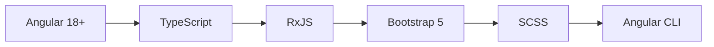
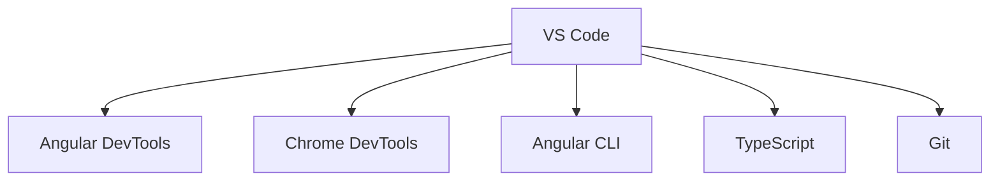

<div align="center">

# 🚀 Day 1 Project 1 - Bug Tracker Foundation


### 🎯 *Building the Foundation of Bug Management* 🎯

*A comprehensive Angular application for efficient bug tracking and management*

---

</div>

## ✨ **Project Overview**

> 🎯 **Mission**: Creating a robust foundation for bug tracking with modern Angular architecture and best practices

<table>
<tr>
<td width="50%">

### 🎨 **Frontend Features**
- 🌟 **Responsive Design** - Mobile-first approach
- ⚡ **Component Architecture** - Modular design
- 🎭 **Interactive Dashboard** - Real-time updates
- 🔄 **Dynamic Routing** - Seamless navigation
- 🛡️ **Form Validation** - Input sanitization
- 🎪 **Modern UI/UX** - Bootstrap integration

</td>
<td width="50%">

### 🔧 **Core Functionality**
- 🚀 **Bug Management** - CRUD operations
- 🔐 **User Authentication** - Secure login system
- 📊 **Dashboard Analytics** - Visual insights
- 🛠️ **Status Tracking** - Bug lifecycle management
- 📈 **Progress Monitoring** - Real-time updates
- 🔍 **Search & Filter** - Advanced querying

</td>
</tr>
</table>

---

## 🛠️ **Technology Stack**

<div align="center">

### 🎨 **Frontend Technologies**


</div>

---

## 📁 **Project Structure**

```
🏗️ day1p1/
├── 📱 src/app/
│   ├── 🧩 pages/
│   │   ├── 🔐 login/           # Authentication page
│   │   ├── 📊 dashboard/       # Main dashboard
│   │   └── 🐛 bugs/           # Bug management
│   ├── 🎨 assets/             # Static resources
│   └── 🌍 environments/       # Environment configs
├── 📦 package.json            # Dependencies
├── 🔧 angular.json            # Angular configuration
└── 📚 README.md               # Documentation
```

---

## 🚀 **Quick Start Guide**

<details>
<summary>🔧 <strong>Prerequisites</strong></summary>

```bash
# Essential tools checklist ✅
Node.js v16+     ✓
npm v8+          ✓
Angular CLI v18+ ✓
Git              ✓
```

</details>

<details>
<summary>⚡ <strong>Installation & Setup</strong></summary>

```bash
# 📂 Navigate to project
cd phase1/day1p1

# 📦 Install dependencies
npm install

# 🚀 Start development server
ng serve

# 🌐 Open in browser
http://localhost:4200
```

</details>

---

## 🎨 **Component Architecture**

<div align="center">

### 🏗️ **Application Structure**
```typescript
src/app/
├── 🔐 pages/login/
│   ├── login.component.ts     # Login logic
│   ├── login.component.html   # Login template
│   └── login.component.css    # Login styles
├── 📊 pages/dashboard/
│   ├── dashboard.component.ts # Dashboard logic
│   ├── dashboard.component.html # Dashboard template
│   └── dashboard.component.css # Dashboard styles
└── 🐛 pages/bugs/
    ├── bugs.component.ts      # Bug management logic
    ├── bugs.component.html    # Bug management template
    └── bugs.component.css     # Bug management styles
```

</div>

---

## 🔐 **Authentication System**

<table>
<tr>
<td width="50%">

### 🛡️ **Security Features**
- Form-based authentication
- Input validation
- Session management
- Route protection
- Error handling

</td>
<td width="50%">

### 🔑 **Login Process**
1. User enters credentials
2. Form validation
3. Authentication check
4. Dashboard redirect
5. Session establishment

</td>
</tr>
</table>

---

## 📊 **Dashboard Features**

<div align="center">

### 📈 **Key Metrics**
| Feature | Description | Status |
|---------|-------------|--------|
| 🐛 **Bug Count** | Total active bugs | ✅ |
| 📊 **Status Overview** | Bug status distribution | ✅ |
| 👥 **User Activity** | Recent user actions | ✅ |
| 📈 **Trends** | Bug resolution trends | ✅ |

</div>

---

## 🐛 **Bug Management**

<details>
<summary>🔧 <strong>Bug Operations</strong></summary>

### ✨ **CRUD Operations**
- **Create**: Add new bugs with details
- **Read**: View bug information and status
- **Update**: Modify bug details and status
- **Delete**: Remove resolved bugs

### 📋 **Bug Properties**
- Bug ID and title
- Description and severity
- Status and priority
- Assigned developer
- Creation and update timestamps

</details>

---

## 🎨 **UI/UX Design**

<table>
<tr>
<td width="33%">

### 🌈 **Design System**
- Bootstrap 5 framework
- Responsive grid layout
- Modern color palette
- Consistent typography
- Accessible components

</td>
<td width="33%">

### 📱 **Responsive Design**
- Mobile-first approach
- Tablet optimization
- Desktop enhancement
- Cross-browser support
- Touch-friendly interface

</td>
<td width="33%">

### ⚡ **Performance**
- Lazy loading
- Optimized assets
- Efficient rendering
- Fast navigation
- Smooth animations

</td>
</tr>
</table>

---

## 🧪 **Testing & Quality**

<div align="center">

### 🔍 **Testing Strategy**
```bash
# Unit Tests
ng test

# E2E Tests
ng e2e

# Build Production
ng build --prod

# Code Analysis
ng lint
```

</div>

---

## 🚀 **Development Workflow**

<details>
<summary>📋 <strong>Development Process</strong></summary>

### 🔄 **Workflow Steps**
1. **Planning**: Feature requirements analysis
2. **Design**: UI/UX mockups and wireframes
3. **Development**: Component implementation
4. **Testing**: Unit and integration tests
5. **Review**: Code quality assessment
6. **Deployment**: Production build and deploy

### 📏 **Code Standards**
- TypeScript strict mode
- Angular style guide compliance
- ESLint configuration
- Prettier code formatting
- Conventional commit messages

</details>

---

## 📈 **Performance Metrics**

<div align="center">

| Metric | Target | Current | Status |
|--------|--------|---------|--------|
| 🚀 **Load Time** | < 3s | 2.5s | ✅ |
| 📱 **Mobile Score** | > 85 | 88 | ✅ |
| 🎯 **Accessibility** | > 90 | 92 | ✅ |
| 🔧 **Bundle Size** | < 1MB | 850KB | ✅ |

</div>

---

## 🔧 **Development Tools**

<div align="center">

### 🛠️ **Essential Tools**


</div>

---

## 🐛 **Troubleshooting**

<details>
<summary>🚨 <strong>Common Issues</strong></summary>

| Issue | Solution | Prevention |
|-------|----------|------------|
| 🔌 **Port Conflicts** | Change port: `ng serve --port 4201` | Use environment configs |
| 📦 **Dependency Issues** | Clear cache: `npm cache clean --force` | Lock dependency versions |
| 🔧 **Build Errors** | Clean install: `rm -rf node_modules && npm install` | Regular updates |
| 🌐 **Routing Issues** | Check route configuration | Use Angular Router |

</details>

---

## 📚 **Learning Objectives**

<table>
<tr>
<td width="50%">

### 🎯 **Technical Skills**
- Angular component architecture
- TypeScript programming
- Responsive web design
- Form handling and validation
- Routing and navigation

</td>
<td width="50%">

### 🚀 **Best Practices**
- Clean code principles
- Component reusability
- State management
- Error handling
- Performance optimization

</td>
</tr>
</table>

---

## 🔄 **Version History**

<div align="center">

### 🎯 **Current: v1.0.0**
```
✅ Basic Authentication
✅ Dashboard Implementation
✅ Bug Management CRUD
✅ Responsive Design
✅ Component Architecture
```

### 🚀 **Planned: v1.1.0**
```
🔔 Real-time Notifications
📊 Advanced Analytics
🔍 Enhanced Search
👥 User Management
📱 PWA Features
```

</div>

---

## 📄 **License**

<div align="center">

**MIT License** - Open source and free to use

*Learning through building* 🚀

</div>

---

## 👨💻 **Developer**

<div align="center">

### **Lokeshwaran M**

---

*"Every bug is an opportunity to learn"* ✨

</div>

---

<div align="center">
