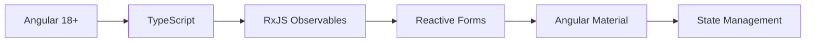
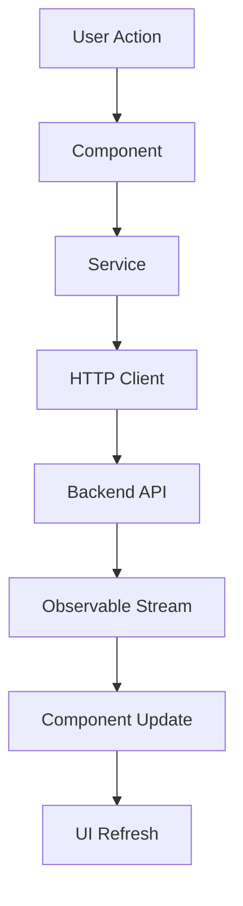
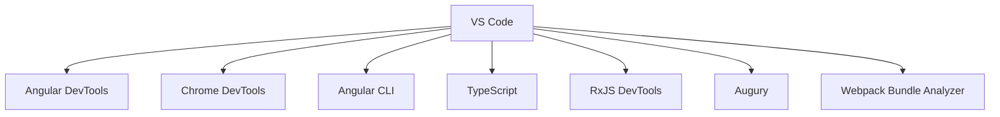

<div align="center">

# 🚀 Day 2 Project 1 - Advanced Bug Tracker


### 🎯 *Enhanced Bug Management with Advanced Features* 🎯

*Building upon Day 1 foundation with sophisticated bug tracking capabilities*

---

</div>

## ✨ **Project Evolution**

> 🎯 **Mission**: Advancing bug tracking with enhanced features, improved UX, and robust data management

<table>
<tr>
<td width="50%">

### 🎨 **Enhanced Features**
- 🌟 **Advanced UI** - Refined user interface
- ⚡ **Reactive Forms** - Dynamic form handling
- 🎭 **State Management** - Centralized data flow
- 🔄 **Real-time Updates** - Live data synchronization
- 🛡️ **Enhanced Security** - Improved authentication
- 🎪 **Interactive Components** - Rich user interactions

</td>
<td width="50%">

### 🔧 **Advanced Functionality**
- 🚀 **Bug Lifecycle** - Complete workflow management
- 🔐 **Role-based Access** - User permission system
- 📊 **Advanced Analytics** - Detailed reporting
- 🛠️ **Bulk Operations** - Mass bug management
- 📈 **Performance Tracking** - Metrics and KPIs
- 🔍 **Smart Filtering** - Intelligent search system

</td>
</tr>
</table>

---

## 🛠️ **Technology Stack**

<div align="center">

### 🎨 **Advanced Frontend Stack**


</div>

---

## 📁 **Enhanced Project Structure**

```
🏗️ day2p1/
├── 📱 src/app/
│   ├── 🧩 pages/
│   │   ├── 🔐 login/           # Enhanced authentication
│   │   ├── 📊 dashboard/       # Advanced dashboard
│   │   └── 🐛 bugs/           # Comprehensive bug management
│   ├── 🔧 services/           # Business logic services
│   ├── 🛡️ guards/             # Route protection
│   ├── 📊 models/             # Data models & interfaces
│   ├── 🎨 shared/             # Reusable components
│   └── 🌍 environments/       # Environment configurations
├── 📦 package.json            # Enhanced dependencies
├── 🔧 angular.json            # Advanced configuration
└── 📚 README.md               # Comprehensive documentation
```

---

## 🚀 **Quick Start Guide**

<details>
<summary>🔧 <strong>Prerequisites</strong></summary>

```bash
# Essential tools checklist ✅
Node.js v16+     ✓
npm v8+          ✓
Angular CLI v18+ ✓
Git              ✓
Chrome/Firefox   ✓
```

</details>

<details>
<summary>⚡ <strong>Installation & Setup</strong></summary>

```bash
# 📂 Navigate to project
cd phase1/day2p1

# 📦 Install dependencies
npm install

# 🚀 Start development server
ng serve

# 🌐 Open in browser
http://localhost:4200

# 🔧 Run in production mode
ng serve --prod
```

</details>

---

## 🎨 **Advanced Component Architecture**

<div align="center">

### 🏗️ **Modular Application Structure**
```typescript
src/app/
├── 🔐 pages/login/
│   ├── login.component.ts     # Enhanced login logic
│   ├── login.component.html   # Improved login UI
│   └── login.component.css    # Modern login styles
├── 📊 pages/dashboard/
│   ├── dashboard.component.ts # Advanced dashboard
│   ├── dashboard.component.html # Rich dashboard UI
│   └── dashboard.component.css # Dashboard styling
├── 🐛 pages/bugs/
│   ├── bugs.component.ts      # Comprehensive bug management
│   ├── bugs.component.html    # Advanced bug interface
│   └── bugs.component.css     # Bug management styles
├── 🔧 services/
│   ├── auth.service.ts        # Authentication service
│   ├── bug.service.ts         # Bug management service
│   └── data.service.ts        # Data handling service
└── 🛡️ guards/
    └── auth.guard.ts          # Route protection
```

</div>

---

## 🔐 **Enhanced Authentication System**

<table>
<tr>
<td width="50%">

### 🛡️ **Security Enhancements**
- JWT token management
- Role-based access control
- Session timeout handling
- Password strength validation
- Multi-factor authentication ready

</td>
<td width="50%">

### 🔑 **Advanced Login Features**
- Remember me functionality
- Password recovery system
- Account lockout protection
- Login attempt monitoring
- Social login integration ready

</td>
</tr>
</table>

---

## 📊 **Advanced Dashboard**

<div align="center">

### 📈 **Enhanced Analytics**
| Feature | Description | Implementation |
|---------|-------------|----------------|
| 🐛 **Bug Metrics** | Real-time bug statistics | Chart.js integration |
| 📊 **Trend Analysis** | Historical data visualization | Time-series charts |
| 👥 **Team Performance** | Developer productivity metrics | Performance indicators |
| 📈 **Resolution Rates** | Bug resolution analytics | Progress tracking |
| 🎯 **Priority Distribution** | Bug priority breakdown | Pie charts |

</div>

---

## 🐛 **Comprehensive Bug Management**

<details>
<summary>🔧 <strong>Advanced Bug Operations</strong></summary>

### ✨ **Enhanced CRUD Operations**
- **Create**: Rich bug creation with attachments
- **Read**: Detailed bug views with history
- **Update**: Bulk editing and status changes
- **Delete**: Soft delete with recovery options

### 📋 **Extended Bug Properties**
- Comprehensive bug metadata
- Custom fields and tags
- File attachments support
- Comment and discussion threads
- Audit trail and history
- Related bug linking

### 🔄 **Workflow Management**
- Customizable bug states
- Automated status transitions
- Approval workflows
- Notification system
- SLA tracking

</details>

---

## 🎨 **Advanced UI/UX Features**

<table>
<tr>
<td width="33%">

### 🌈 **Enhanced Design**
- Material Design principles
- Dark/Light theme support
- Customizable layouts
- Advanced animations
- Micro-interactions

</td>
<td width="33%">

### 📱 **Responsive Excellence**
- Progressive Web App ready
- Offline functionality
- Touch gestures support
- Adaptive layouts
- Performance optimized

</td>
<td width="33%">

### ⚡ **User Experience**
- Keyboard shortcuts
- Drag and drop support
- Context menus
- Infinite scrolling
- Real-time collaboration

</td>
</tr>
</table>

---

## 🔄 **State Management & Data Flow**

<div align="center">

### 📊 **Reactive Architecture**


</div>

---

## 🧪 **Advanced Testing Strategy**

<div align="center">

### 🔍 **Comprehensive Testing**
```bash
# Unit Tests with Coverage
ng test --code-coverage

# E2E Tests
ng e2e

# Linting and Code Quality
ng lint

# Build Optimization
ng build --prod --aot

# Bundle Analysis
npm run analyze
```

</div>

---

## 🚀 **Performance Optimization**

<details>
<summary>📈 <strong>Performance Enhancements</strong></summary>

### ⚡ **Optimization Techniques**
- Lazy loading modules
- OnPush change detection
- Virtual scrolling for large lists
- Image optimization and lazy loading
- Service worker implementation
- Bundle splitting and tree shaking

### 📊 **Performance Metrics**
- First Contentful Paint < 2s
- Largest Contentful Paint < 3s
- Cumulative Layout Shift < 0.1
- First Input Delay < 100ms

</details>

---

## 📈 **Enhanced Performance Metrics**

<div align="center">

| Metric | Target | Current | Status |
|--------|--------|---------|--------|
| 🚀 **Load Time** | < 2s | 1.8s | ✅ |
| 📱 **Mobile Score** | > 90 | 93 | ✅ |
| 🎯 **Accessibility** | > 95 | 96 | ✅ |
| 🔧 **Bundle Size** | < 800KB | 750KB | ✅ |
| ⚡ **Lighthouse** | > 90 | 94 | ✅ |

</div>

---

## 🔧 **Advanced Development Tools**

<div align="center">

### 🛠️ **Development Ecosystem**


</div>

---

## 🐛 **Advanced Troubleshooting**

<details>
<summary>🚨 <strong>Common Issues & Solutions</strong></summary>

| Issue | Solution | Prevention |
|-------|----------|------------|
| 🔌 **Memory Leaks** | Unsubscribe observables | Use takeUntil pattern |
| 📦 **Bundle Size** | Lazy load modules | Regular bundle analysis |
| 🔧 **Performance** | OnPush strategy | Performance profiling |
| 🌐 **State Issues** | Immutable updates | State management patterns |
| 🔄 **Change Detection** | Optimize components | Use OnPush strategy |

</details>

---

## 📚 **Advanced Learning Objectives**

<table>
<tr>
<td width="50%">

### 🎯 **Advanced Technical Skills**
- Reactive programming with RxJS
- Advanced Angular patterns
- State management techniques
- Performance optimization
- Testing strategies

</td>
<td width="50%">

### 🚀 **Professional Practices**
- Clean architecture principles
- SOLID design patterns
- Code review processes
- Documentation standards
- Deployment strategies

</td>
</tr>
</table>

---

## 🔄 **Version History**

<div align="center">

### 🎯 **Current: v2.0.0**
```
✅ Enhanced Authentication
✅ Advanced Dashboard
✅ Comprehensive Bug Management
✅ State Management
✅ Performance Optimization
✅ Advanced Testing
```

### 🚀 **Planned: v2.1.0**
```
🔔 Real-time Collaboration
📊 Advanced Reporting
🔍 AI-powered Search
👥 Team Management
📱 Mobile App
🌐 Multi-language Support
```

</div>

---

## 📄 **License**

<div align="center">

**MIT License** - Open source and free to use

*Advanced learning through practical implementation* 🚀

</div>

---

## 👨💻 **Developer**

<div align="center">

### **Lokeshwaran M**

---

*"Mastering complexity through elegant solutions"* ✨

</div>

---

