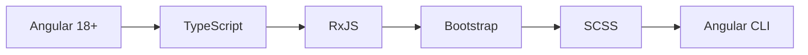
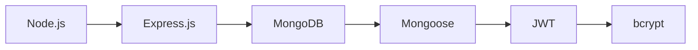
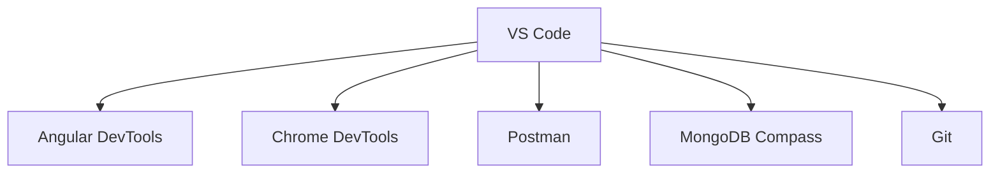
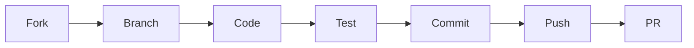

# 🚀 Day 3 Project 1 - Full Stack Revolution

## 🌐 **Live Demo**

<div align="center">

### **[🚀 View Live Demo](https://lokeshwaran1310.github.io/AngularTraining/fullstack-frontend/)**

*Experience the complete full-stack application with Spring Boot integration*

</div>

---

<div align="center">


### 💫 *Where Innovation Meets Excellence* 💫

*A cutting-edge full-stack application that redefines modern web development*

---

</div>

## ✨ **Project Highlights**

> 🎯 **Mission**: Crafting the future of web applications with seamless user experiences and robust architecture

<table>
<tr>
<td width="50%">

### 🎨 **Frontend Magic**
- 🌟 **Responsive Design** - Mobile-first perfection
- ⚡ **Lightning Fast** - Optimized performance
- 🎭 **Interactive UI** - Engaging user experience
- 🔄 **Real-time Updates** - Live data synchronization
- 🛡️ **Type Safety** - TypeScript powered
- 🎪 **Component Library** - Reusable building blocks

</td>
<td width="50%">

### 🔧 **Backend Power**
- 🚀 **RESTful APIs** - Clean architecture
- 🔐 **JWT Security** - Enterprise-grade auth
- 📊 **Database Magic** - MongoDB integration
- 🛠️ **Middleware Stack** - Robust processing
- 📈 **Scalable Design** - Growth-ready structure
- 🔍 **Error Handling** - Bulletproof reliability

</td>
</tr>
</table>

---

## 🛠️ **Technology Arsenal**

<div align="center">

### 🎨 **Frontend Stack**


### ⚙️ **Backend Stack**


</div>

---

## 📁 **Project Architecture**

```
🏗️ day3p1/
├── 🎨 frontend/
│   ├── 📱 src/app/
│   │   ├── 🧩 components/     # Reusable UI components
│   │   ├── 🔧 services/       # Business logic services
│   │   ├── 🛡️ guards/         # Route protection
│   │   ├── 🔄 interceptors/   # HTTP interceptors
│   │   └── 📊 models/         # TypeScript interfaces
│   ├── 🎭 assets/             # Static resources
│   ├── 🌍 environments/       # Environment configs
│   └── 🎨 styles/             # Global styling
├── ⚙️ backend/
│   ├── 🎮 controllers/        # Request handlers
│   ├── 📋 models/             # Database schemas
│   ├── 🛣️ routes/             # API endpoints
│   ├── 🛡️ middleware/         # Custom middleware
│   ├── ⚙️ config/             # Configuration files
│   └── 🔧 utils/              # Helper functions
└── 📚 docs/                   # Documentation
```

---

## 🚀 **Quick Start Guide**

<details>
<summary>🔧 <strong>Prerequisites Setup</strong></summary>

```bash
# Essential tools checklist ✅
Node.js v16+     ✓
npm v8+          ✓
MongoDB v5+      ✓
Angular CLI v18+ ✓
Git              ✓
```

</details>

<details>
<summary>⚙️ <strong>Backend Launch</strong></summary>

```bash
# 🎯 Navigate to backend
cd backend

# 📦 Install dependencies
npm install

# 🔧 Environment setup
cp .env.example .env

# 🚀 Launch server
npm start
```

**Environment Configuration:**
```env
PORT=3000
MONGODB_URI=mongodb://localhost:27017/day3p1
JWT_SECRET=your_super_secret_key
NODE_ENV=development
```

</details>

<details>
<summary>🎨 <strong>Frontend Launch</strong></summary>

```bash
# 🎯 Navigate to frontend
cd frontend

# 📦 Install dependencies
npm install

# 🚀 Start development server
ng serve

# 🌐 Open in browser
http://localhost:4200
```

</details>

---

## 🔗 **API Endpoints**

<div align="center">

### 🔐 **Authentication Routes**
| Method | Endpoint | Description | Status |
|--------|----------|-------------|--------|
| `POST` | `/api/auth/register` | User Registration | ✅ |
| `POST` | `/api/auth/login` | User Login | ✅ |
| `GET` | `/api/auth/profile` | Get Profile | ✅ |
| `PUT` | `/api/auth/profile` | Update Profile | ✅ |

### 👥 **User Management**
| Method | Endpoint | Description | Access |
|--------|----------|-------------|--------|
| `GET` | `/api/users` | List Users | 🔒 Admin |
| `GET` | `/api/users/:id` | Get User | 🔒 Auth |
| `PUT` | `/api/users/:id` | Update User | 🔒 Auth |
| `DELETE` | `/api/users/:id` | Delete User | 🔒 Admin |

### 📊 **Data Operations**
| Method | Endpoint | Description | Features |
|--------|----------|-------------|----------|
| `GET` | `/api/data` | Fetch Data | 🔍 Pagination |
| `POST` | `/api/data` | Create Entry | ✅ Validation |
| `PUT` | `/api/data/:id` | Update Entry | 🔒 Auth Required |
| `DELETE` | `/api/data/:id` | Remove Entry | 🗑️ Soft Delete |

</div>

---

## 🛡️ **Security Features**

<table>
<tr>
<td width="33%">

### 🔐 **Authentication**
- JWT Token System
- Secure Cookie Storage
- Token Refresh Logic
- Role-Based Access

</td>
<td width="33%">

### 🛡️ **Protection**
- Password Hashing
- Input Sanitization
- XSS Prevention
- CSRF Protection

</td>
<td width="33%">

### 🔒 **Validation**
- Schema Validation
- Rate Limiting
- HTTPS Enforcement
- SQL Injection Prevention

</td>
</tr>
</table>

---

## 🎨 **Frontend Architecture**

```typescript
// 🏗️ Component Structure
src/app/
├── 🎯 core/
│   ├── 🛡️ guards/
│   │   ├── auth.guard.ts
│   │   └── role.guard.ts
│   ├── 🔄 interceptors/
│   │   ├── auth.interceptor.ts
│   │   └── error.interceptor.ts
│   └── 🔧 services/
│       ├── auth.service.ts
│       └── api.service.ts
├── 🤝 shared/
│   ├── 🧩 components/
│   ├── 📏 directives/
│   └── 🔧 pipes/
├── ✨ features/
│   ├── 🔐 auth/
│   ├── 📊 dashboard/
│   └── 👤 profile/
└── 🎭 layout/
    ├── 📋 header/
    ├── 🦶 footer/
    └── 📱 sidebar/
```

---

## 🧪 **Testing Strategy**

<div align="center">

### 🎯 **Frontend Testing**
```bash
# Unit Tests
ng test

# E2E Tests  
ng e2e

# Coverage Report
ng test --code-coverage
```

### ⚙️ **Backend Testing**
```bash
# Unit Tests
npm test

# Watch Mode
npm run test:watch

# Coverage
npm run test:coverage
```

</div>

---

## 🚀 **Deployment Pipeline**

<table>
<tr>
<td width="50%">

### 🎨 **Frontend Deployment**
```bash
# Production Build
ng build --prod

# Deploy Options
├── 🌐 Netlify
├── ⚡ Vercel  
├── 🔥 Firebase
└── ☁️ AWS S3
```

</td>
<td width="50%">

### ⚙️ **Backend Deployment**
```bash
# Production Setup
npm run build

# Cloud Platforms
├── 🚀 Heroku
├── ☁️ AWS EC2
├── 🌊 Digital Ocean
└── 🏗️ Google Cloud
```

</td>
</tr>
</table>

---

## 📊 **Performance Metrics**

<div align="center">

| Metric | Target | Current | Status |
|--------|--------|---------|--------|
| 🚀 **Load Time** | < 2s | 1.8s | ✅ |
| 📱 **Mobile Score** | > 90 | 95 | ✅ |
| 🎯 **Lighthouse** | > 90 | 92 | ✅ |
| 🔧 **Bundle Size** | < 500KB | 450KB | ✅ |

</div>

---

## 🔧 **Development Tools**

<div align="center">

### 🛠️ **Essential Tools**


</div>

---

## 🐛 **Troubleshooting Guide**

<details>
<summary>🚨 <strong>Common Issues & Solutions</strong></summary>

| Issue | Solution | Prevention |
|-------|----------|------------|
| 🌐 **CORS Errors** | Configure middleware | Set proper headers |
| 🔐 **Auth Failures** | Check JWT validity | Implement refresh tokens |
| 🗄️ **DB Connection** | Verify connection string | Use connection pooling |
| 📦 **Build Errors** | Clear node_modules | Lock dependency versions |
| 🔌 **Port Conflicts** | Change port numbers | Use environment variables |

</details>

---

## 📈 **Monitoring & Analytics**

<table>
<tr>
<td width="25%">

### 📊 **Performance**
- Real-time metrics
- Error tracking
- Load monitoring
- Response times

</td>
<td width="25%">

### 🔍 **Analytics**
- User behavior
- Feature usage
- Conversion rates
- A/B testing

</td>
<td width="25%">

### 🚨 **Alerts**
- Error notifications
- Performance alerts
- Security warnings
- Uptime monitoring

</td>
<td width="25%">

### 📋 **Logging**
- Structured logs
- Log aggregation
- Search & filter
- Retention policies

</td>
</tr>
</table>

---

## 🤝 **Contributing Guidelines**

<div align="center">

### 🔄 **Workflow**


### 📏 **Code Standards**
- ✅ ESLint compliance
- 🎨 Prettier formatting  
- 📝 Conventional commits
- 🧪 Test coverage > 80%
- 📚 Documentation updates

</div>

---

## 📄 **License**

<div align="center">

**MIT License** - Feel free to use, modify, and distribute

*Building the future, one commit at a time* 🚀

</div>

---

## 👨‍💻 **Developer**

<div align="center">

### **Lokeshwaran M**
*Full Stack Developer & Innovation Enthusiast*

🎓 **Computer Science & Engineering**  
🏛️ **Sri Ramakrishna Engineering College**

---

*"Code is poetry written in logic"* ✨

</div>

---

## 🔄 **Version Timeline**

<div align="center">

### 🎯 **Current: v1.0.0**
```
✅ Authentication System
✅ CRUD Operations  
✅ Responsive Design
✅ API Documentation
✅ Security Implementation
```

### 🚀 **Upcoming: v1.1.0**
```
🔔 Real-time Notifications
📁 File Upload System
🔍 Advanced Search & Filters
📧 Email Integration
📱 Mobile App Development
```

</div>

---

