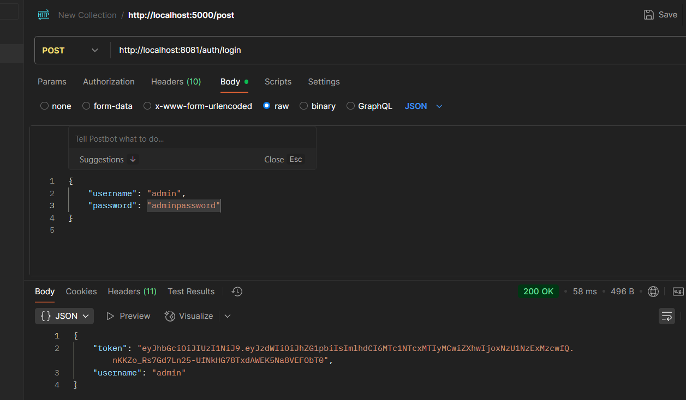
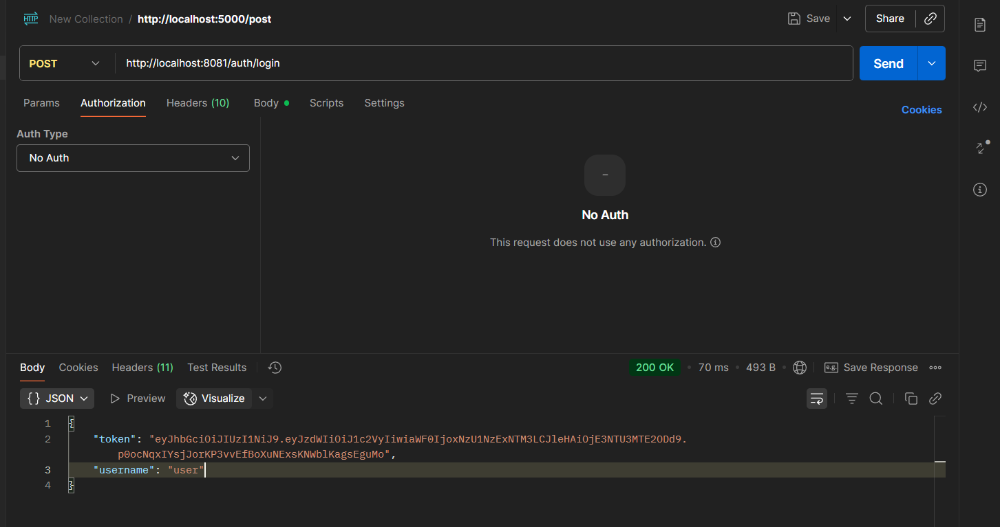
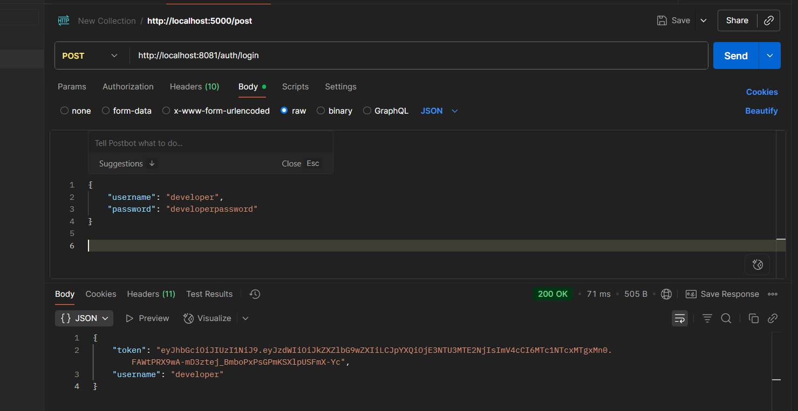
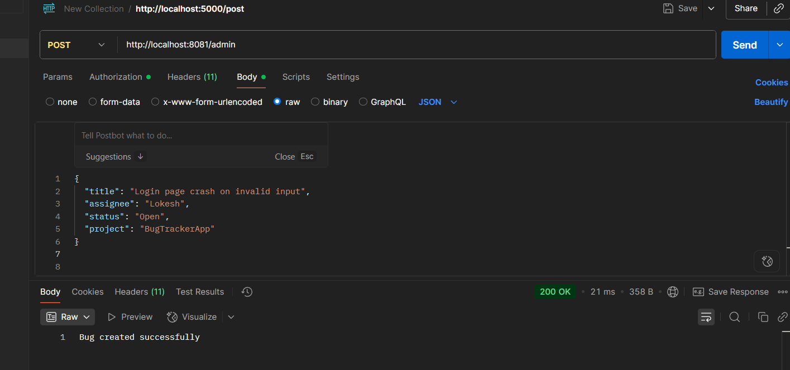
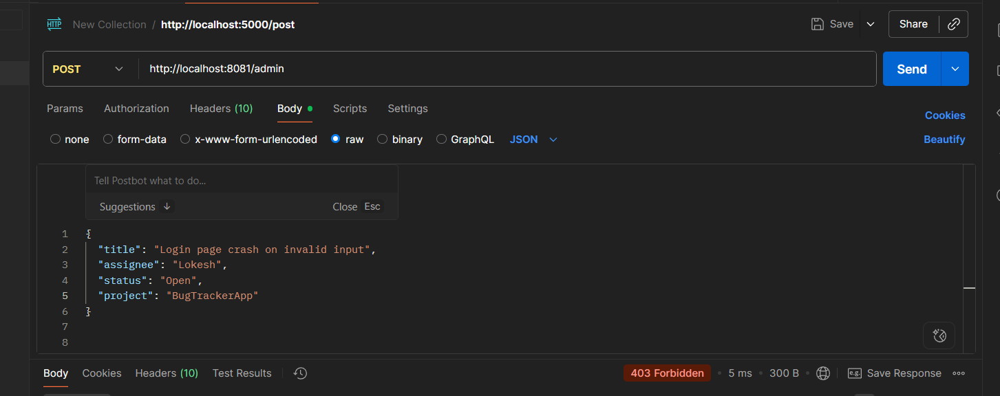
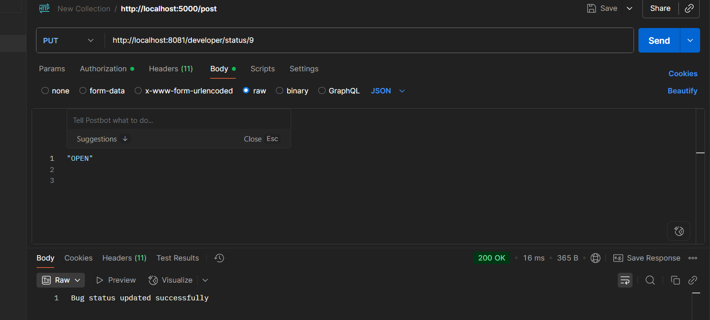
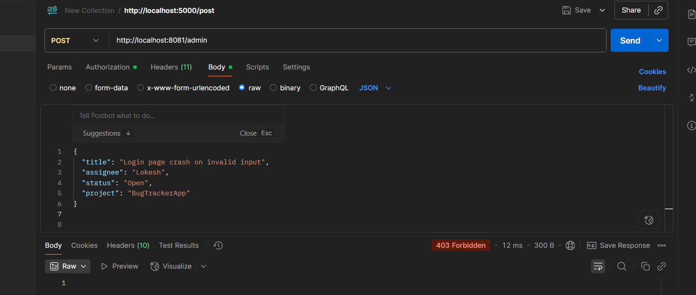

# 🐛 Bug Tracker Security - JWT Authentication & Role-Based Access Control

[](https://spring.io/projects/spring-boot)
[](https://www.oracle.com/java/)
[](https://maven.apache.org/)
[](https://github.com/jwtk/jjwt)
[](LICENSE)

A comprehensive **Bug Tracking System** built with Spring Boot, featuring robust **JWT-based authentication** and **role-based authorization** with three distinct user roles: Admin, User, and Developer.

## 📋 Table of Contents

- [Overview](#overview)
- [Features](#features)
- [Technology Stack](#technology-stack)
- [Architecture](#architecture)
- [Security Configuration](#security-configuration)
- [API Documentation](#api-documentation)
- [Installation & Setup](#installation--setup)
- [Testing Guide](#testing-guide)
- [Project Structure](#project-structure)
- [Contributing](#contributing)

## 🎯 Overview

This application provides a secure, scalable solution for bug tracking and management. It implements industry-standard security practices with role-based access control, ensuring that sensitive operations are restricted to authorized personnel while maintaining accessibility for read operations.

### 🔄 Evolution: Basic Auth → JWT Authentication

This project has evolved from HTTP Basic Authentication to JWT-based authentication:

**Previous Implementation:**
- HTTP Basic Authentication with username/password
- Two roles: Admin and User
- Session-based authentication

**Current Implementation (Enhanced):**
- JWT token-based authentication
- Three roles: Admin, User, and Developer
- Stateless authentication with token expiration
- Enhanced security with JWT validation
- Developer role with specific permissions (Read + Update Status)

### Key Highlights
- **JWT Authentication**: Stateless token-based authentication with Spring Security
- **Role-Based Authorization**: Three-tier access control (Admin, User, Developer)
- **RESTful API Design**: Clean, intuitive endpoints following REST principles
- **Data Persistence**: JPA/Hibernate with H2 in-memory database
- **Comprehensive Filtering**: Multiple search and filter capabilities
- **Pagination Support**: Efficient data retrieval with pagination

## ✨ Features

### 🔐 Security Features
- JWT token-based authentication
- Role-based access control (RBAC) with 3 roles
- Stateless authentication (no server-side sessions)
- In-memory user management
- CSRF protection disabled for API usage
- Secure password encoding
- Token expiration and validation

### 📊 Bug Management
- Create, read, update, and delete bugs
- Advanced filtering by status, assignee, project, and title
- Pagination and sorting capabilities
- Search functionality with multiple parameters
- Metadata retrieval for pagination info

### 🎨 API Features
- RESTful endpoint design
- JSON request/response format
- Comprehensive error handling
- Consistent response structure

## 🛠 Technology Stack

| Technology | Version | Purpose |
|------------|---------|----------|
| **Java** | 17+ | Programming Language |
| **Spring Boot** | 3.5.4 | Application Framework |
| **Spring Security** | 6.x | Authentication & Authorization |
| **JWT (JJWT)** | 0.11.5 | JSON Web Token Implementation |
| **Spring Data JPA** | 3.x | Data Access Layer |
| **Hibernate** | 6.x | ORM Framework |
| **H2 Database** | 2.x | In-Memory Database |
| **Maven** | 3.6+ | Build Tool |
| **Jackson** | 2.x | JSON Processing |

## 🏗 Architecture

```
┌─────────────────┐    ┌─────────────────┐    ┌─────────────────┐
│   Controller    │────│     Service     │────│   Repository    │
│   (REST API)    │    │  (Business      │    │  (Data Access)  │
│                 │    │   Logic)        │    │                 │
└─────────────────┘    └─────────────────┘    └─────────────────┘
         │                       │                       │
         ▼                       ▼                       ▼
┌─────────────────┐    ┌─────────────────┐    ┌─────────────────┐
│  Security       │    │      DTO        │    │     Entity      │
│  Configuration  │    │   (Data         │    │   (Database     │
│                 │    │  Transfer)      │    │    Model)       │
└─────────────────┘    └─────────────────┘    └─────────────────┘
```

## 🔒 Security Configuration

### User Roles & Permissions

| Role | Permissions | Description |
|------|-------------|-------------|
| **ADMIN** | Full CRUD Access | Can create, read, update, and delete bugs |
| **USER** | Read-Only Access | Can only view and search bugs |
| **DEVELOPER** | Read + Update Status | Can view bugs and update bug status only |

### Default User Accounts

| Username | Password | Role | Access Level |
|----------|----------|------|-------------|
| `admin` | `adminpassword` | ADMIN | Full Access |
| `user` | `userpassword` | USER | Read-Only |
| `developer` | `developerpassword` | DEVELOPER | Read + Update Status |

### Security Implementation

```java
// Security configuration highlights
- JWT Authentication Filter
- Stateless session management
- Role-based URL protection
- CSRF disabled for API usage
- In-memory user details service
- Token-based authorization
```

## 📚 API Documentation

### Base URL
```
http://localhost:8081
```

### Authentication
All endpoints require JWT token authentication. First login to get a token, then use it in subsequent requests.

### JWT Authentication Flow
1. **Login**: POST `/auth/login` with username/password to get JWT token
2. **Use Token**: Include `Authorization: Bearer <token>` header in API requests
3. **Token Validation**: Tokens expire after 150 seconds (configurable)

### Authentication Endpoints

#### Login
```http
POST /auth/login
Content-Type: application/json

{
    "username": "admin",
    "password": "adminpassword"
}
```

#### Validate Token
```http
GET /auth/validate
Authorization: Bearer <jwt_token>
```

#### Get Current User
```http
GET /auth/user
Authorization: Bearer <jwt_token>
```

### Admin Endpoints (🔐 ADMIN Role Required)

#### Create Bug
```http
POST /admin
Content-Type: application/json
Authorization: Bearer <jwt_token>

{
    "title": "Critical UI Bug",
    "status": "OPEN",
    "assignee": "john.doe@company.com",
    "project": "Web Application"
}
```

#### Update Bug
```http
PUT /admin/{id}
Content-Type: application/json
Authorization: Bearer <jwt_token>

{
    "title": "Updated Bug Title",
    "status": "IN_PROGRESS",
    "assignee": "jane.smith@company.com",
    "project": "Mobile App"
}
```

#### Delete Bug
```http
DELETE /admin/{id}
Authorization: Bearer <jwt_token>
```

### Developer Endpoints (🔧 ADMIN & DEVELOPER Roles)

#### Update Bug Status
```http
PUT /developer/status/{id}
Content-Type: application/json
Authorization: Bearer <jwt_token>

"IN_PROGRESS"
```

### Bug Viewing Endpoints (👥 ADMIN, USER & DEVELOPER Roles)

#### Get All Bugs
```http
GET /bugs/all
Authorization: Bearer <jwt_token>
```

#### Filter by Status
```http
GET /bugs/status/{status}
# Example: GET /bugs/status/OPEN
```

#### Filter by Assignee
```http
GET /bugs/assignee/{assignee}
# Example: GET /bugs/assignee/john.doe
```

#### Filter by Project
```http
GET /bugs/project/{project}
# Example: GET /bugs/project/WebApp
```

#### Search with Title
```http
GET /bugs/title/{title}
# Example: GET /bugs/title/login
```

#### Paginated Results
```http
GET /bugs/page?page=0&size=10&sort=title,asc
```

#### Advanced Search
```http
GET /bugs/search?title=login&status=OPEN&assignee=john&page=0&size=5
```

#### Pagination Metadata
```http
GET /bugs/metadata?page=0&size=10
```

#### Custom Pagination
```http
GET /bugs/changedefaultindex?pageNumber=1&size=20
```

### Response Format

#### Success Response
```json
{
    "id": 1,
    "title": "Sample Bug",
    "status": "OPEN",
    "assignee": "john.doe@company.com",
    "project": "Web Application"
}
```

#### Error Response
```json
{
    "timestamp": "2024-01-15T10:30:00.000+00:00",
    "status": 403,
    "error": "Forbidden",
    "message": "Access Denied",
    "path": "/admin"
}
```

## 🚀 Installation & Setup

### Prerequisites
- Java 17 or higher
- Maven 3.6 or higher
- Git (for cloning)

### Step-by-Step Installation

1. **Clone the Repository**
   ```bash
   git clone <repository-url>
   cd bugtrackersecuritybasicauth
   ```

2. **Build the Project**
   ```bash
   mvn clean compile
   ```

3. **Run Tests**
   ```bash
   mvn test
   ```

4. **Start the Application**
   ```bash
   mvn spring-boot:run
   ```

5. **Verify Installation**
   ```bash
   # Login to get token
   curl -X POST http://localhost:8081/auth/login \
     -H "Content-Type: application/json" \
     -d '{"username":"admin","password":"adminpassword"}'
   
   # Use token to access API
   curl -H "Authorization: Bearer <token>" http://localhost:8081/bugs/all
   ```

### Configuration

#### Application Properties
```properties
# Server Configuration
server.port=8081

# Database Configuration
spring.datasource.url=jdbc:h2:mem:testdb
spring.h2.console.enabled=true

# JPA Configuration
spring.jpa.hibernate.ddl-auto=update
spring.jpa.show-sql=true
spring.data.web.pageable.default-page-size=10
```

## 🧪 Testing Guide

### Role-Based Access Control Testing

The application supports three user roles with different permission levels:

| Role | Username | Password | Permissions |
|------|----------|----------|-------------|
| **ADMIN** | `admin` | `adminpassword` | Full CRUD Access |
| **USER** | `user` | `userpassword` | Read-Only Access |
| **DEVELOPER** | `developer` | `developerpassword` | Read + Update Status |

### 📸 Role-Based Testing Screenshots

#### 1. Admin Login - POST /auth/login
*Screenshot showing successful admin login with JWT token response*



#### 2. User Login - POST /auth/login  
*Screenshot showing successful user login with JWT token response*



#### 3. Developer Login - POST /auth/login
*Screenshot showing successful developer login with JWT token response*



#### 4. Admin Create Bug - POST /admin
*Screenshot showing admin successfully creating a new bug*



#### 5. User Access Denied - POST /admin
*Screenshot showing 403 Forbidden when user tries to create bug*



#### 6. Developer Update Status - PUT /developer/status/{id}
*Screenshot showing developer successfully updating bug status*



#### 7. Developer Access Denied - POST /admin
*Screenshot showing 403 Forbidden when developer tries to create bug*



### Using Postman

1. **Setup Collection**
   - Import the provided Postman collection
   - Set base URL: `http://localhost:8081`

2. **Configure Authentication**
   - Use JWT tokens from login responses
   - Add Authorization header: `Bearer <token>`

3. **Test Scenarios**

   **Admin User Testing:**
   ```
   Username: admin
   Password: adminpassword
   
   ✅ Can access all endpoints
   ✅ Can create, update, delete bugs
   ✅ Can read all bug data
   ✅ Can update bug status
   ```

   **Regular User Testing:**
   ```
   Username: user
   Password: userpassword
   
   ✅ Can read bug data
   ❌ Cannot access admin endpoints (403 Forbidden)
   ❌ Cannot update bug status (403 Forbidden)
   ```

   **Developer User Testing:**
   ```
   Username: developer
   Password: developerpassword
   
   ✅ Can read bug data
   ✅ Can update bug status
   ❌ Cannot create bugs (403 Forbidden)
   ❌ Cannot delete bugs (403 Forbidden)
   ```

### Using cURL

#### JWT Authentication with cURL

```bash
# Step 1: Login to get JWT token
curl -X POST http://localhost:8081/auth/login \
  -H "Content-Type: application/json" \
  -d '{"username":"admin","password":"adminpassword"}'

# Response: {"token":"eyJhbGciOiJIUzI1NiIsInR5cCI6IkpXVCJ9...","username":"admin"}

# Step 2: Use token for API requests
TOKEN="eyJhbGciOiJIUzI1NiIsInR5cCI6IkpXVCJ9..."

# Admin Operations
curl -X POST http://localhost:8081/admin \
  -H "Authorization: Bearer $TOKEN" \
  -H "Content-Type: application/json" \
  -d '{
    "title": "Test Bug",
    "status": "OPEN",
    "assignee": "tester@company.com",
    "project": "Test Project"
  }'

# Developer Operations
curl -X PUT http://localhost:8081/developer/status/1 \
  -H "Authorization: Bearer $TOKEN" \
  -H "Content-Type: application/json" \
  -d '"IN_PROGRESS"'

# User Operations
curl -H "Authorization: Bearer $TOKEN" http://localhost:8081/bugs/all
```

## 📁 Project Structure

```
bugtrackersecuritybasicauth/
├── src/
│   ├── main/
│   │   ├── java/
│   │   │   └── com/example/bugtrackersecuritybasicauth/
│   │   │       ├── config/
│   │   │       │   ├── SecurityConfig.java
│   │   │       │   └── JwtAuthenticationFilter.java
│   │   │       ├── controller/
│   │   │       │   ├── AuthController.java
│   │   │       │   └── BugController.java
│   │   │       ├── dto/
│   │   │       │   ├── AuthRequestDto.java
│   │   │       │   ├── AuthResponseDto.java
│   │   │       │   ├── BugResponseDTO.java
│   │   │       │   └── MetaData.java
│   │   │       ├── entity/
│   │   │       │   └── Bug.java
│   │   │       ├── repository/
│   │   │       │   └── BugRepository.java
│   │   │       ├── service/
│   │   │       │   ├── BugService.java
│   │   │       │   └── JwtService.java
│   │   │       └── BugtrackersecuritybasicauthApplication.java
│   │   └── resources/
│   │       └── application.properties
│   └── test/
│       └── java/
├── target/
├── pom.xml
└── README.md
```

### Component Descriptions

| Component | Responsibility |
|-----------|----------------|
| **SecurityConfig** | JWT authentication and authorization configuration |
| **JwtAuthenticationFilter** | JWT token validation filter |
| **AuthController** | JWT authentication endpoints |
| **JwtService** | JWT token generation and validation |
| **BugController** | REST API endpoints and request handling |
| **BugService** | Business logic and data processing |
| **BugRepository** | Data access and database operations |
| **Bug Entity** | Database model and entity mapping |
| **DTOs** | Data transfer objects for API responses |

## 🤝 Contributing

### Development Guidelines

1. **Code Style**
   - Follow Java naming conventions
   - Use meaningful variable and method names
   - Add appropriate comments for complex logic

2. **Security Best Practices**
   - Never hardcode credentials in production
   - Validate all input parameters
   - Use HTTPS in production environments
   - Implement proper error handling

3. **Testing**
   - Write unit tests for service layer
   - Add integration tests for API endpoints
   - Test both positive and negative scenarios

### Future Enhancements

- [x] JWT token-based authentication ✅
- [x] Role-based access control with Developer role ✅
- [ ] Refresh token implementation
- [ ] Database migration to PostgreSQL/MySQL
- [ ] Email notifications for bug assignments
- [ ] File attachment support
- [ ] Audit logging
- [ ] API rate limiting
- [ ] OpenAPI/Swagger documentation
- [ ] Docker containerization

---

**Author**: Lokeshwaran M

**📄 License**: This project is licensed under the MIT License.

**🏷️ Version**: 1.0.0