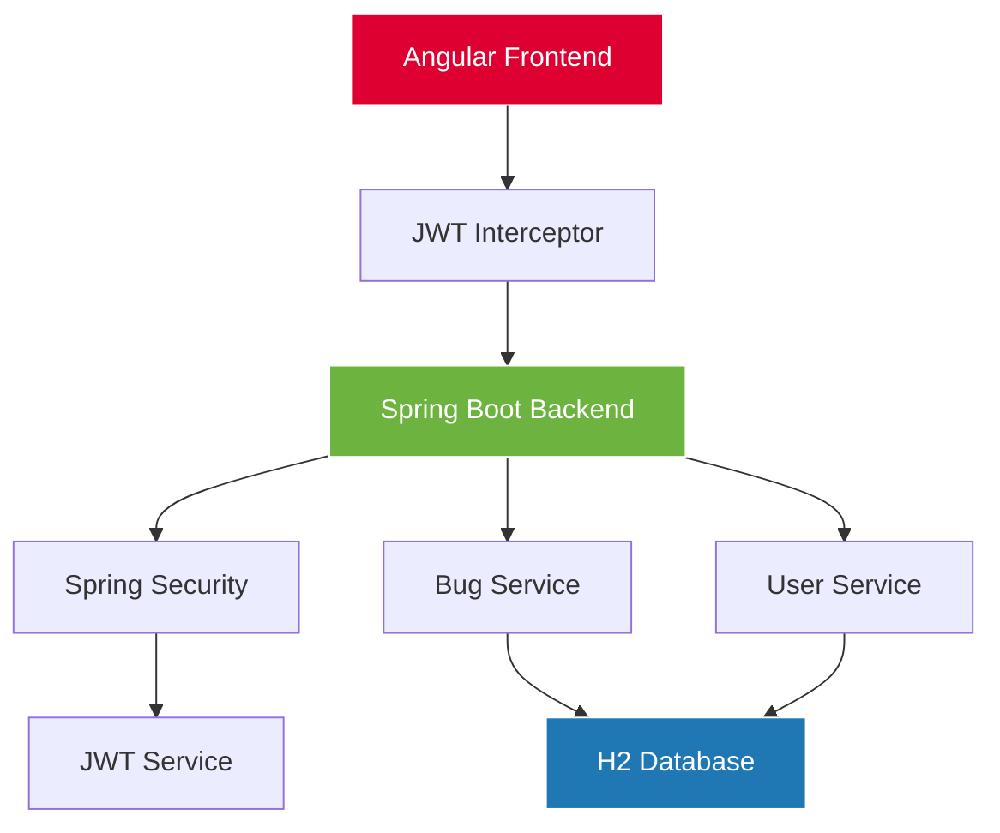
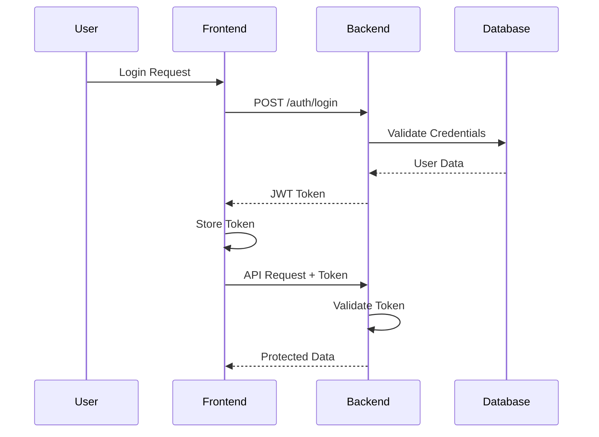

# 🐛 Bug Tracker Pro

<div align="center">


**A Modern, Full-Stack Bug Tracking Application**

[](https://angular.io/)
[](https://spring.io/projects/spring-boot)
[](https://www.typescriptlang.org/)
[](https://www.oracle.com/java/)

---

*Streamline your development workflow with our enterprise-grade bug tracking solution*

</div>

## 🚀 Live Demo

<div align="center">

### 🌐 **[View Live Application](http://localhost:4200)**

**Frontend:** `http://localhost:4200` | **Backend API:** `http://localhost:8085`

</div>

---

## 📋 Table of Contents

- [🎯 Overview](#-overview)
- [✨ Features](#-features)
- [🏗️ Architecture](#️-architecture)
- [🛠️ Technology Stack](#️-technology-stack)
- [📁 Project Structure](#-project-structure)
- [🚀 Quick Start](#-quick-start)
- [🔐 Authentication](#-authentication)
- [📊 API Documentation](#-api-documentation)
- [🎨 UI/UX Design](#-uiux-design)
- [🔒 Security](#-security)
- [📱 Responsive Design](#-responsive-design)
- [🧪 Testing](#-testing)
- [📈 Performance](#-performance)
- [🔧 Configuration](#-configuration)
- [🚀 Deployment](#-deployment)
- [🤝 Contributing](#-contributing)
- [📄 License](#-license)
- [👨‍💻 Developer](#-developer)

---

## 🎯 Overview

**Bug Tracker Pro** is a cutting-edge, full-stack web application designed to revolutionize how development teams manage and track software issues. Built with modern technologies and best practices, it offers a seamless experience for bug reporting, tracking, and resolution.

### 🌟 Why Choose Bug Tracker Pro?

- **🔐 Enterprise Security**: JWT-based authentication with role-based access control
- **🎨 Modern UI**: Sleek black, grey, and white theme with responsive design
- **⚡ Real-time Updates**: Instant bug statistics and live search functionality
- **🏢 Role-based Workflow**: Tailored experiences for Admins, Developers, and Users
- **📱 Mobile-First**: Fully responsive design that works on all devices

---

## ✨ Features

### 🔐 **Authentication & Authorization**

<table>
<tr>
<td width="50%">

#### 🔑 **Secure Login System**
- JWT token-based authentication
- Secure password encryption
- Session management
- Auto-logout on token expiry

</td>
<td width="50%">

#### 👥 **Role-Based Access Control**
- **Admin**: Full CRUD operations
- **Developer**: Bug status updates
- **User**: Read-only access
- Dynamic UI based on permissions

</td>
</tr>
</table>

### 🐛 **Bug Management**

<div align="center">

| Feature | Admin | Developer | User |
|---------|-------|-----------|------|
| View Bugs | ✅ | ✅ | ✅ |
| Create Bugs | ✅ | ❌ | ❌ |
| Update Bugs | ✅ | 🔄 Status Only | ❌ |
| Delete Bugs | ✅ | ❌ | ❌ |
| Search by ID | ✅ | ✅ | ✅ |

</div>

### 🎨 **User Interface**

- **🌙 Dark Theme**: Modern black, grey, and white color scheme
- **📱 Responsive Design**: Optimized for desktop, tablet, and mobile
- **🧭 Dynamic Navigation**: Context-aware menu system
- **🔍 Smart Search**: Instant bug lookup by ID
- **📊 Dashboard**: Real-time bug statistics and insights

---

## 🏗️ Architecture

<div align="center">



</div>

### 🔄 **Request Flow**

1. **Frontend** sends authenticated requests with JWT tokens
2. **JWT Interceptor** automatically attaches tokens to requests
3. **Spring Security** validates tokens and enforces role-based access
4. **Controllers** process requests and delegate to services
5. **Services** handle business logic and database operations
6. **H2 Database** stores and retrieves data

---

## 🛠️ Technology Stack

<div align="center">

### **Frontend Technologies**


### **Backend Technologies**


### **Development Tools**


</div>

---

## 📁 Project Structure

```
🏗️ day4p1/
├── 🖥️ backend/
│   ├── 📂 src/main/java/com/example/bugtrackersecuritybasicauth/
│   │   ├── ⚙️ config/
│   │   │   ├── 🔐 SecurityConfig.java
│   │   │   ├── 🎫 JwtAuthenticationFilter.java
│   │   │   └── 🌐 CorsConfig.java
│   │   ├── 🎮 controller/
│   │   │   ├── 🔑 AuthController.java
│   │   │   └── 🐛 BugController.java
│   │   ├── 📦 dto/
│   │   │   ├── 🔐 AuthRequestDto.java
│   │   │   ├── 📤 AuthResponseDto.java
│   │   │   └── 📝 RegisterRequestDto.java
│   │   ├── 🏛️ entity/
│   │   │   ├── 👤 User.java
│   │   │   └── 🐛 Bug.java
│   │   ├── 🗄️ repository/
│   │   │   ├── 👥 UserRepository.java
│   │   │   └── 🐛 BugRepository.java
│   │   └── 🔧 service/
│   │       ├── 🎫 JwtService.java
│   │       ├── 👤 UserService.java
│   │       └── 🐛 BugService.java
│   └── 📋 pom.xml
└── 🌐 frontend/
    ├── 📂 src/app/
    │   ├── 📄 pages/
    │   │   ├── 🏠 dashboard/
    │   │   ├── 🔐 login/
    │   │   ├── 📝 register/
    │   │   └── 🐛 bugs/
    │   ├── 🔧 services/
    │   │   ├── 🔑 auth.service.ts
    │   │   └── 🐛 bug.service.ts
    │   └── 🛡️ interceptors/
    │       └── 🎫 jwt.interceptor.ts
    └── 📦 package.json
```

---

## 🚀 Quick Start

### 📋 **Prerequisites**

- ☕ **Java 17+**
- 🟢 **Node.js 18+**
- 📦 **npm 9+**
- 🔧 **Maven 3.8+**

### ⚡ **Installation**

#### 1️⃣ **Clone the Repository**

```bash
git clone https://github.com/your-username/bug-tracker-pro.git
cd bug-tracker-pro
```

#### 2️⃣ **Backend Setup**

```bash
# Navigate to backend directory
cd backend

# Install dependencies and build
mvn clean install

# Run the application
mvn spring-boot:run
```

🎯 **Backend will be available at:** `http://localhost:8085`

#### 3️⃣ **Frontend Setup**

```bash
# Navigate to frontend directory
cd frontend

# Install dependencies
npm install

# Start development server
ng serve
```

🎯 **Frontend will be available at:** `http://localhost:4200`

---

## 🔐 Authentication

### 🎫 **JWT Token Flow**

<div align="center">



</div>

### 👥 **Default User Accounts**

<div align="center">

| 👤 Username | 🔑 Password | 🏷️ Role | 🎯 Permissions |
|-------------|-------------|----------|----------------|
| `admin` | `adminpassword` | **ADMIN** | Full CRUD access |
| `developer` | `developerpassword` | **DEVELOPER** | Update bug status |
| `user` | `userpassword` | **USER** | Read-only access |

</div>

---

## 📊 API Documentation

### 🔐 **Authentication Endpoints**

<table>
<tr>
<th>Method</th>
<th>Endpoint</th>
<th>Description</th>
<th>Access</th>
</tr>
<tr>
<td><code>POST</code></td>
<td><code>/auth/login</code></td>
<td>User authentication</td>
<td>🌐 Public</td>
</tr>
<tr>
<td><code>POST</code></td>
<td><code>/auth/register</code></td>
<td>User registration</td>
<td>🌐 Public</td>
</tr>
<tr>
<td><code>GET</code></td>
<td><code>/auth/validate</code></td>
<td>Token validation</td>
<td>🔒 Protected</td>
</tr>
<tr>
<td><code>GET</code></td>
<td><code>/auth/user</code></td>
<td>Current user info</td>
<td>🔒 Protected</td>
</tr>
</table>

### 🐛 **Bug Management Endpoints**

<table>
<tr>
<th>Method</th>
<th>Endpoint</th>
<th>Description</th>
<th>Role Required</th>
</tr>
<tr>
<td><code>GET</code></td>
<td><code>/bugs/all</code></td>
<td>Retrieve all bugs</td>
<td>👥 All Roles</td>
</tr>
<tr>
<td><code>GET</code></td>
<td><code>/bugs/search</code></td>
<td>Search bugs with filters</td>
<td>👥 All Roles</td>
</tr>
<tr>
<td><code>POST</code></td>
<td><code>/admin</code></td>
<td>Create new bug</td>
<td>👑 Admin Only</td>
</tr>
<tr>
<td><code>PUT</code></td>
<td><code>/admin/{id}</code></td>
<td>Update bug details</td>
<td>👑 Admin Only</td>
</tr>
<tr>
<td><code>DELETE</code></td>
<td><code>/admin/{id}</code></td>
<td>Delete bug</td>
<td>👑 Admin Only</td>
</tr>
<tr>
<td><code>PUT</code></td>
<td><code>/developer/status/{id}</code></td>
<td>Update bug status</td>
<td>🔧 Developer/Admin</td>
</tr>
</table>

---

## 🎨 UI/UX Design

### 🌙 **Dark Theme Design System**

<div align="center">

| Color | Hex Code | Usage |
|-------|----------|-------|
| **Primary Black** | `#1a1a1a` | Headers, buttons, text |
| **Secondary Black** | `#2d2d2d` | Hover states, accents |
| **Light Grey** | `#f5f5f5` | Background, cards |
| **Medium Grey** | `#9e9e9e` | Borders, secondary text |
| **Dark Grey** | `#424242` | Icons, labels |
| **Pure White** | `#ffffff` | Text on dark, card backgrounds |

</div>

### 📱 **Responsive Breakpoints**

- **🖥️ Desktop**: `1200px+`
- **💻 Laptop**: `992px - 1199px`
- **📱 Tablet**: `768px - 991px`
- **📱 Mobile**: `< 768px`

---

## 🔒 Security

### 🛡️ **Security Features**

- **🔐 JWT Authentication**: Stateless token-based authentication
- **🔑 Password Encryption**: Secure password hashing with Spring Security
- **🚪 Role-Based Access**: Granular permission control
- **🌐 CORS Protection**: Cross-origin request security
- **🛡️ CSRF Protection**: Cross-site request forgery prevention
- **⏰ Token Expiration**: Automatic session timeout

### 🔍 **Security Best Practices**

- Input validation and sanitization
- SQL injection prevention
- XSS protection
- Secure HTTP headers
- Environment-based configuration

---

## 📱 Responsive Design

### 🖥️ **Desktop Experience**
- Full navigation bar with all menu items
- Multi-column layouts for optimal space usage
- Hover effects and smooth transitions

### 📱 **Mobile Experience**
- Collapsible sidebar navigation
- Touch-friendly buttons and inputs
- Optimized layouts for small screens

---

## 🧪 Testing

### 🔬 **Testing Strategy**

- **Unit Tests**: Component and service testing
- **Integration Tests**: API endpoint testing
- **E2E Tests**: Full user workflow testing
- **Security Tests**: Authentication and authorization testing

---

## 📈 Performance

### ⚡ **Optimization Features**

- **Lazy Loading**: Route-based code splitting
- **HTTP Interceptors**: Automatic token management
- **Caching**: Strategic data caching
- **Minification**: Optimized production builds

---

## 🔧 Configuration

### ⚙️ **Environment Variables**

```properties
# Backend Configuration
server.port=8085
spring.datasource.url=jdbc:h2:mem:testdb
jwt.secret=your-secret-key
jwt.expiration=86400000

# Frontend Configuration
API_BASE_URL=http://localhost:8085
```

---

## 🚀 Deployment

### 🐳 **Docker Deployment**

```dockerfile
# Backend Dockerfile
FROM openjdk:17-jdk-slim
COPY target/bug-tracker-backend.jar app.jar
EXPOSE 8085
ENTRYPOINT ["java", "-jar", "/app.jar"]

# Frontend Dockerfile
FROM node:18-alpine
WORKDIR /app
COPY package*.json ./
RUN npm install
COPY . .
RUN npm run build
EXPOSE 4200
CMD ["npm", "start"]
```

### ☁️ **Cloud Deployment Options**

- **AWS**: EC2, ECS, or Elastic Beanstalk
- **Azure**: App Service or Container Instances
- **Google Cloud**: App Engine or Cloud Run
- **Heroku**: Easy deployment with buildpacks

---

## 🤝 Contributing

We welcome contributions! Please follow these steps:

1. **🍴 Fork** the repository
2. **🌿 Create** a feature branch (`git checkout -b feature/amazing-feature`)
3. **💾 Commit** your changes (`git commit -m 'Add amazing feature'`)
4. **📤 Push** to the branch (`git push origin feature/amazing-feature`)
5. **🔄 Open** a Pull Request

### 📝 **Contribution Guidelines**

- Follow existing code style and conventions
- Write comprehensive tests for new features
- Update documentation for any API changes
- Ensure all tests pass before submitting PR

---

## 📄 License

This project is licensed under the **MIT License** - see the [LICENSE](LICENSE) file for details.

---

## 👨‍💻 Developer

<div align="center">

### **Lokesh M**

*Full-Stack Developer & Software Engineer*

---

*"Building robust, scalable applications with modern technologies and best practices"*

**🛠️ Expertise:** Full-Stack Development | Spring Boot | Angular | Microservices | Cloud Architecture

**🎯 Specializations:** Enterprise Applications | Security Implementation | Performance Optimization

</div>

---
