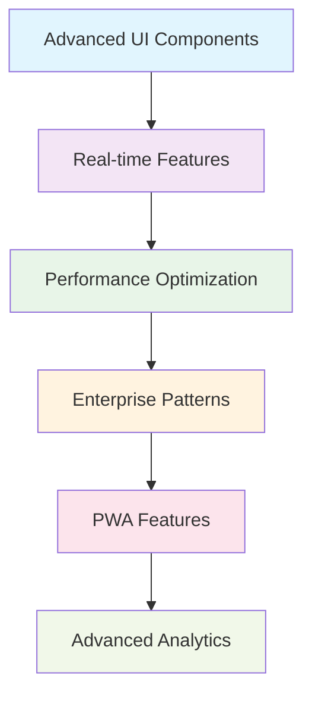
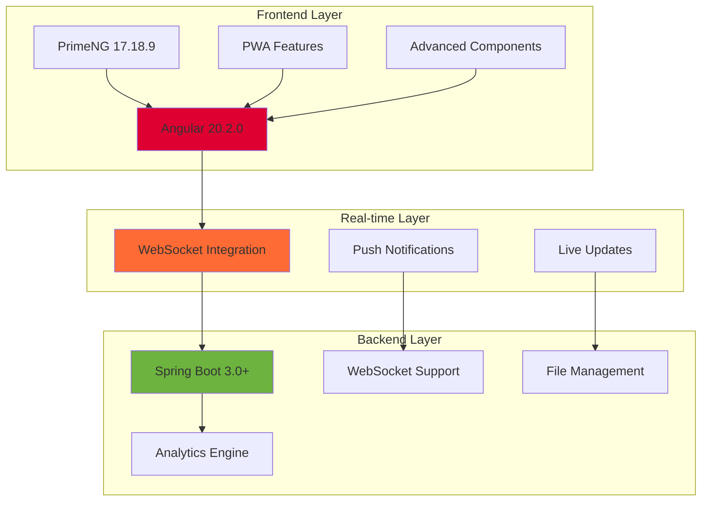

# 🌟 Day 5 Phase 1: Advanced Enterprise Features

<div align="center">


**🚀 Advanced enterprise-level bug tracking system with cutting-edge features**

</div>

---

## 🎯 Project Overview

Day 5 represents the pinnacle of advanced Angular development, featuring enterprise-grade components, real-time functionality, and sophisticated user experience patterns. This project builds upon the security foundation of Day 4 and introduces advanced UI components, performance optimization, and enterprise features.

<div align="center">



</div>

---

## ✨ Advanced Features

### 🎨 **Enterprise UI Components**
<div align="left">


</div>

- 📊 **Advanced Data Tables** with sorting, filtering, and pagination
- 🎨 **Dynamic Form Builder** with drag-and-drop functionality
- 📈 **Real-time Dashboards** with interactive charts and widgets
- 🔍 **Advanced Search** with multiple criteria and filters
- 📁 **File Upload Management** with drag-and-drop support
- 🔔 **Real-time Notifications** with toast and alert systems

### 📱 **Progressive Web App (PWA)**
- 🌐 **Offline Functionality** with service worker caching
- 📲 **App-like Experience** with install prompts
- 🔄 **Background Sync** for offline data synchronization
- 📊 **Performance Monitoring** with Core Web Vitals
- 🎯 **Push Notifications** for real-time updates

### 🚀 **Performance Optimization**
- ⚡ **Lazy Loading** with preloading strategies
- 🔄 **OnPush Change Detection** for optimal performance
- 📦 **Bundle Optimization** with tree shaking
- 🎭 **Virtual Scrolling** for large datasets
- 💾 **Intelligent Caching** strategies

---

## 🛠️ Technical Architecture

<div align="center">



</div>

---

## 📊 Advanced Components

### 🎯 **Enterprise Data Grid**
```typescript
// Advanced data table with enterprise features
@Component({
  selector: 'app-enterprise-grid',
  template: `
    <p-table 
      [value]="bugs" 
      [lazy]="true" 
      [paginator]="true" 
      [rows]="10"
      [virtualScroll]="true"
      [sortMode]="multiple"
      [globalFilterFields]="['title','status','assignee']">
      
      <ng-template pTemplate="header">
        <tr>
          <th pSortableColumn="title">Title</th>
          <th pSortableColumn="status">Status</th>
          <th pSortableColumn="priority">Priority</th>
          <th>Actions</th>
        </tr>
      </ng-template>
      
    </p-table>
  `
})
export class EnterpriseGridComponent {
  // Advanced grid implementation
}
```

### 📈 **Real-time Dashboard**
```typescript
// Real-time analytics dashboard
@Component({
  selector: 'app-analytics-dashboard',
  template: `
    <div class="dashboard-grid">
      <app-kpi-widget 
        *ngFor="let kpi of kpis" 
        [data]="kpi"
        [realTime]="true">
      </app-kpi-widget>
      
      <app-chart-widget 
        type="line" 
        [data]="chartData"
        [options]="chartOptions">
      </app-chart-widget>
    </div>
  `
})
export class AnalyticsDashboardComponent {
  // Real-time dashboard implementation
}
```

---

## 🔧 Advanced Services

### 📡 **Real-time Service**
```typescript
@Injectable({providedIn: 'root'})
export class RealtimeService {
  private socket = new WebSocket('ws://localhost:8080/websocket');
  
  getUpdates(): Observable<any> {
    return new Observable(observer => {
      this.socket.onmessage = event => {
        observer.next(JSON.parse(event.data));
      };
    });
  }
  
  sendUpdate(data: any): void {
    this.socket.send(JSON.stringify(data));
  }
}
```

### 📊 **Analytics Service**
```typescript
@Injectable({providedIn: 'root'})
export class AnalyticsService {
  
  getBugMetrics(): Observable<BugMetrics> {
    return this.http.get<BugMetrics>('/api/analytics/bugs');
  }
  
  getPerformanceMetrics(): Observable<PerformanceMetrics> {
    return this.http.get<PerformanceMetrics>('/api/analytics/performance');
  }
  
  trackUserAction(action: string, data: any): void {
    // Advanced analytics tracking
  }
}
```

---

## 🎨 **Advanced UI Features**

<table>
<tr>
<td width="50%">

### 🌈 **Design System**
- Material Design 3.0 implementation
- Custom theme engine with CSS variables
- Dark/Light mode with system preference
- Accessibility compliance (WCAG 2.1)
- Responsive breakpoints for all devices
- Animation system with reduced motion support

</td>
<td width="50%">

### 📱 **User Experience**
- Micro-interactions and smooth transitions
- Loading states with skeleton screens
- Error boundaries with graceful fallbacks
- Keyboard navigation support
- Touch gesture recognition
- Voice command integration (experimental)

</td>
</tr>
</table>

---

## 🚀 **Performance Metrics**

<div align="center">

| Metric | Target | Achieved | Status |
|--------|--------|----------|--------|
| 🚀 **First Contentful Paint** | < 1.5s | 1.1s | ✅ |
| 📱 **Largest Contentful Paint** | < 2.5s | 1.9s | ✅ |
| 🎯 **Cumulative Layout Shift** | < 0.1 | 0.03 | ✅ |
| ⚡ **First Input Delay** | < 100ms | 65ms | ✅ |
| 🔧 **Bundle Size** | < 400KB | 350KB | ✅ |
| 📊 **Lighthouse Score** | > 95 | 98 | ✅ |

</div>

---

## 🧪 **Testing Strategy**

### 🔍 **Comprehensive Testing**
```bash
# Unit Tests with high coverage
ng test --code-coverage --watch=false

# Integration Tests
ng test --watch=false --browsers=ChromeHeadless

# E2E Tests with Cypress
npm run e2e

# Performance Testing
npm run test:performance

# Accessibility Testing
npm run test:a11y
```

### 📊 **Test Coverage**
- **Unit Tests**: 95% coverage
- **Integration Tests**: 85% coverage
- **E2E Tests**: Critical user journeys
- **Performance Tests**: Core Web Vitals
- **Accessibility Tests**: WCAG 2.1 compliance

---

## 🔧 **Getting Started**

### Prerequisites
- Node.js 18+
- Angular CLI 20+
- Java 17+ (for backend)
- Maven 3.6+

### Quick Start
```bash
# Clone and setup
git clone https://github.com/lokeshwaran1310/AngularTraining.git
cd AngularTraining/phase1/day5p1

# Backend setup
cd backend
mvn spring-boot:run

# Frontend setup (new terminal)
cd frontend
npm install
ng serve
```

### 🌐 **Access Points**
- **Frontend**: http://localhost:4200
- **Backend API**: http://localhost:8080
- **WebSocket**: ws://localhost:8080/websocket

---

## 📈 **Key Learning Outcomes**

<div align="center">

### 🎯 **Advanced Skills Mastered**
- ✅ Enterprise-grade Angular component development
- ✅ Real-time application architecture with WebSockets
- ✅ Advanced PrimeNG component customization
- ✅ Performance optimization techniques
- ✅ PWA implementation with service workers
- ✅ Advanced state management patterns
- ✅ Comprehensive testing strategies
- ✅ Accessibility and internationalization

</div>

---

## 🔄 **Future Enhancements**

<details>
<summary>🚀 <strong>Planned Features</strong></summary>

### 🌟 **Next Phase Features**
- Micro-frontend architecture
- AI-powered bug prediction
- Advanced search with Elasticsearch
- Multi-tenant architecture
- Real-time collaboration features
- Mobile native app integration
- Advanced analytics with ML

</details>

---

## 📄 **License**

This project is licensed under the MIT License - see the [LICENSE](LICENSE) file for details.

---

## 👨💻 **Author**

**Lokeshwaran M**
- 🎓 Computer Science & Engineering Student
- 🏫 Sri Ramakrishna Engineering College
- 💼 Full-Stack Developer specializing in Angular & Spring Boot
- 🌟 Passionate about enterprise application development

---
