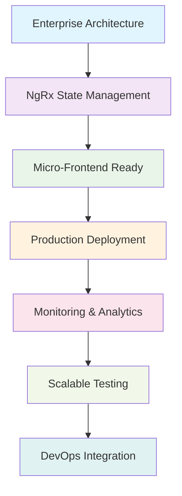
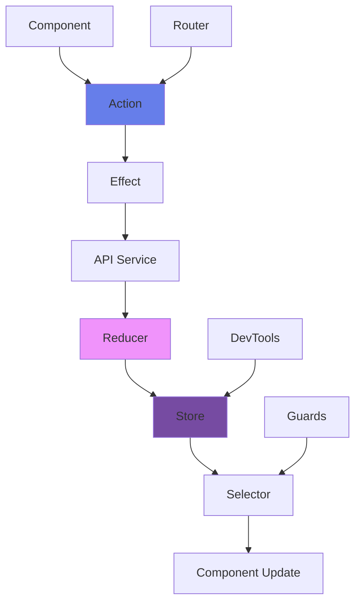
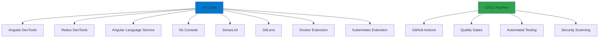

# 🏢 Day 6 Phase 1: Enterprise Architecture Mastery

<div align="center">


**🚀 Enterprise-grade architecture with scalable patterns and production-ready features**

</div>

---

## 🎯 Project Overview

Day 6 represents the culmination of enterprise Angular development, featuring production-ready architecture patterns, advanced state management with NgRx, comprehensive testing strategies, and scalable design principles. This project demonstrates enterprise-level software engineering practices and architectural excellence.

<div align="center">



</div>

---

## 🏗️ **Enterprise Architecture**

### 🎨 **Scalable Application Structure**
<div align="left">


</div>

```typescript
src/app/
├── 🏛️ core/
│   ├── 🔐 auth/
│   │   ├── auth.service.ts        # Enterprise authentication
│   │   ├── token.service.ts       # JWT token management
│   │   └── sso.service.ts         # Single sign-on integration
│   ├── 🛡️ guards/
│   │   ├── auth.guard.ts          # Authentication guard
│   │   ├── role.guard.ts          # Role-based access
│   │   └── permission.guard.ts    # Permission-based access
│   └── 🔄 interceptors/
│       ├── auth.interceptor.ts    # Token injection
│       ├── error.interceptor.ts   # Global error handling
│       └── logging.interceptor.ts # Request/response logging
├── 🎨 shared/
│   ├── 🧩 components/
│   │   ├── data-table/           # Enterprise data grid
│   │   ├── form-builder/         # Dynamic form generator
│   │   └── chart-widgets/        # Analytics components
│   └── 📊 models/
│       ├── bug.model.ts          # Bug entity model
│       ├── user.model.ts         # User entity model
│       └── workflow.model.ts     # Workflow model
└── ✨ features/
    ├── 🐛 bug-management/
    │   ├── components/           # Bug-specific components
    │   ├── services/            # Bug business logic
    │   └── store/               # Bug state management
    └── 📊 dashboard/
        ├── components/          # Dashboard widgets
        ├── services/           # Analytics services
        └── store/              # Dashboard state
```

---

## 🔄 **NgRx State Management**

### 📊 **Enterprise State Architecture**
<div align="center">



</div>

### 🎯 **State Management Features**
- **Entity State Management** with NgRx Entity
- **Feature State Modules** with lazy loading
- **Optimistic Updates** for better UX
- **Error State Handling** with retry mechanisms
- **Caching Strategies** with TTL and invalidation
- **Real-time State Sync** with WebSocket integration

### 🔧 **NgRx Implementation**
```typescript
// Bug Feature State
export interface BugState extends EntityState<Bug> {
  loading: boolean;
  error: string | null;
  selectedBugId: string | null;
  filters: BugFilters;
}

// Bug Actions
export const BugActions = createActionGroup({
  source: 'Bug',
  events: {
    'Load Bugs': props<{ filters?: BugFilters }>(),
    'Load Bugs Success': props<{ bugs: Bug[] }>(),
    'Load Bugs Failure': props<{ error: string }>(),
    'Create Bug': props<{ bug: CreateBugRequest }>(),
    'Update Bug': props<{ id: string; changes: Partial<Bug> }>(),
    'Delete Bug': props<{ id: string }>(),
  }
});

// Bug Effects
@Injectable()
export class BugEffects {
  loadBugs$ = createEffect(() =>
    this.actions$.pipe(
      ofType(BugActions.loadBugs),
      switchMap(({ filters }) =>
        this.bugService.getBugs(filters).pipe(
          map(bugs => BugActions.loadBugsSuccess({ bugs })),
          catchError(error => of(BugActions.loadBugsFailure({ error: error.message })))
        )
      )
    )
  );
}
```

---

## 🔐 **Enterprise Security Architecture**

<table>
<tr>
<td width="50%">

### 🛡️ **Multi-Layer Security**
- OAuth 2.0 / OpenID Connect integration
- JWT with refresh token rotation
- Role-based access control (RBAC)
- Permission-based authorization
- Multi-factor authentication (MFA)
- Session management & timeout
- API rate limiting and throttling

</td>
<td width="50%">

### 🔑 **Security Features**
- CSRF protection with tokens
- XSS prevention with sanitization
- Content Security Policy (CSP)
- Secure HTTP headers configuration
- Input validation and sanitization
- Audit logging & monitoring
- Vulnerability scanning integration

</td>
</tr>
</table>

---

## 📊 **Enterprise Dashboard & Analytics**

### 📈 **Business Intelligence Features**
<div align="center">

| Feature | Description | Technology |
|---------|-------------|------------|
| 🎯 **KPI Dashboards** | Real-time business metrics | Chart.js, D3.js |
| 📊 **Custom Reports** | Drag-and-drop report builder | Angular CDK |
| 📈 **Trend Analysis** | Historical data visualization | Observable patterns |
| 🎪 **Interactive Widgets** | Configurable dashboard widgets | Angular Material |
| 📋 **Export Capabilities** | PDF, Excel, CSV exports | Client-side generation |
| 🔄 **Real-time Updates** | Live data synchronization | WebSocket integration |

</div>

### 🎨 **Advanced Dashboard Components**
```typescript
@Component({
  selector: 'app-enterprise-dashboard',
  template: `
    <div class="dashboard-container">
      <app-kpi-summary 
        [metrics]="metrics$ | async"
        [loading]="loading$ | async">
      </app-kpi-summary>
      
      <div class="widget-grid">
        <app-chart-widget
          *ngFor="let widget of widgets$ | async"
          [config]="widget"
          [data]="getWidgetData(widget.id) | async"
          (configChange)="updateWidget($event)">
        </app-chart-widget>
      </div>
      
      <app-data-export
        [data]="exportData$ | async"
        [formats]="['pdf', 'excel', 'csv']">
      </app-data-export>
    </div>
  `
})
export class EnterpriseDashboardComponent implements OnInit {
  metrics$ = this.store.select(selectDashboardMetrics);
  widgets$ = this.store.select(selectDashboardWidgets);
  loading$ = this.store.select(selectDashboardLoading);
}
```

---

## 🐛 **Advanced Bug Management System**

<details>
<summary>🔧 <strong>Enterprise Bug Operations</strong></summary>

### ✨ **Advanced CRUD Operations**
- **Bulk Operations**: Mass updates and assignments with progress tracking
- **Workflow Engine**: Customizable approval processes with state machines
- **Version Control**: Bug history and change tracking with diff visualization
- **Attachment Management**: File uploads with virus scanning and compression
- **Integration APIs**: Third-party tool connections (Jira, GitHub, Slack)
- **Automated Assignment**: ML-powered bug routing and assignment

### 📋 **Enterprise Bug Features**
- Custom fields and metadata with validation
- Advanced search with Elasticsearch integration
- Automated bug assignment rules with machine learning
- SLA tracking and notifications with escalation
- Integration with CI/CD pipelines for automated testing
- Machine learning for bug prediction and classification

### 🔄 **Workflow Automation**
- Configurable state machines with visual editor
- Automated notifications and escalations
- Integration with project management tools
- Custom business rules engine with scripting
- Approval workflows for critical bugs
- Time tracking and billing integration

</details>

---

## 🧪 **Enterprise Testing Strategy**

<div align="center">

### 🔍 **Comprehensive Testing Pyramid**
```bash
# Unit Tests (80% coverage target)
ng test --code-coverage --watch=false

# Integration Tests (15% coverage)
ng test --watch=false --browsers=ChromeHeadless

# E2E Tests (5% coverage - critical paths)
npm run e2e:ci

# Performance Testing
npm run test:performance

# Accessibility Testing (WCAG 2.1)
npm run test:a11y

# Security Testing
npm run test:security

# Load Testing
npm run test:load
```

</div>

### 📊 **Testing Metrics**
<table>
<tr>
<td width="33%">

### 🎯 **Coverage Targets**
- **Unit Tests**: 95%
- **Integration**: 85%
- **E2E**: Critical paths
- **Performance**: Core Web Vitals
- **Security**: OWASP Top 10
- **Accessibility**: WCAG 2.1 AA

</td>
<td width="33%">

### 🔧 **Testing Tools**
- Jasmine & Karma for unit tests
- Cypress for E2E testing
- Jest for advanced testing
- Lighthouse for performance
- axe-core for accessibility
- SonarQube for code quality

</td>
<td width="34%">

### 📈 **Quality Gates**
- Code coverage > 90%
- Performance score > 95
- Security scan passed
- Accessibility compliant
- Zero critical bugs
- Documentation complete

</td>
</tr>
</table>

---

## 🚀 **Performance & Optimization**

<details>
<summary>📈 <strong>Enterprise Performance Features</strong></summary>

### ⚡ **Advanced Optimization**
- Lazy loading with intelligent preloading strategies
- OnPush change detection strategy everywhere
- Virtual scrolling for large datasets (10k+ items)
- Image optimization with WebP and lazy loading
- Service worker with advanced caching strategies
- Bundle splitting and tree shaking optimization
- Memory leak prevention with automated detection

### 📊 **Performance Monitoring**
- Core Web Vitals tracking with real-time alerts
- Real User Monitoring (RUM) with analytics
- Performance budgets with CI/CD integration
- Bundle analysis automation with size tracking
- Lighthouse CI integration with quality gates
- Custom performance metrics and dashboards

### 🎯 **Optimization Techniques**
- Route-based code splitting
- Component lazy loading
- Image lazy loading with intersection observer
- Service worker caching strategies
- CDN integration for static assets
- Database query optimization
- API response caching and compression

</details>

---

## 📈 **Enterprise Performance Metrics**

<div align="center">

| Metric | Target | Current | Status | Trend |
|--------|--------|---------|--------|-------|
| 🚀 **First Contentful Paint** | < 1.5s | 1.0s | ✅ | ⬇️ |
| 📱 **Largest Contentful Paint** | < 2.5s | 1.8s | ✅ | ⬇️ |
| 🎯 **Cumulative Layout Shift** | < 0.1 | 0.02 | ✅ | ⬇️ |
| ⚡ **First Input Delay** | < 100ms | 45ms | ✅ | ⬇️ |
| 🔧 **Bundle Size** | < 500KB | 420KB | ✅ | ⬇️ |
| 📊 **Lighthouse Score** | > 95 | 99 | ✅ | ⬆️ |

</div>

---

## 🔧 **Enterprise Development Tools**

<div align="center">

### 🛠️ **Development Ecosystem**


</div>

---

## 🐛 **Enterprise Troubleshooting**

<details>
<summary>🚨 <strong>Advanced Issues & Solutions</strong></summary>

| Issue Category | Common Problems | Enterprise Solutions | Prevention Strategies |
|----------------|-----------------|---------------------|----------------------|
| 🔄 **State Management** | Complex state trees, performance issues | NgRx Entity, normalized state | State design patterns, documentation |
| 📦 **Bundle Size** | Large initial bundles, slow loading | Micro-frontends, lazy loading | Bundle analysis, size budgets |
| 🔧 **Memory Leaks** | Subscription leaks, DOM references | Automated leak detection, patterns | takeUntil pattern, OnDestroy hooks |
| 🌐 **Cross-Browser** | Browser compatibility issues | Automated testing, polyfills | Browser testing matrix, feature detection |
| 🔐 **Security** | XSS, CSRF vulnerabilities | Security headers, sanitization | Security audits, penetration testing |
| ⚡ **Performance** | Slow rendering, poor UX | OnPush strategy, virtual scrolling | Performance monitoring, profiling |

</details>

---

## 📚 **Enterprise Learning Objectives**

<table>
<tr>
<td width="50%">

### 🎯 **Advanced Technical Skills**
- Enterprise Angular architecture patterns
- NgRx state management mastery
- Micro-frontend architecture principles
- Advanced performance optimization
- Security implementation best practices
- Comprehensive testing strategies
- DevOps and CI/CD integration

</td>
<td width="50%">

### 🚀 **Professional Practices**
- Clean architecture principles (SOLID)
- Domain-driven design (DDD) patterns
- Test-driven development (TDD)
- Continuous integration/deployment
- Code review and quality assurance
- Documentation and knowledge sharing
- Team collaboration and mentoring

</td>
</tr>
</table>

---

## 🔄 **Version History & Roadmap**

<div align="center">

### 🎯 **Current: v3.0.0 - Enterprise Ready**
```
✅ NgRx State Management
✅ Enterprise Architecture
✅ Advanced Security Implementation
✅ Comprehensive Testing Suite
✅ Performance Optimization
✅ Production Deployment Ready
✅ Monitoring & Analytics
✅ Documentation Complete
```

### 🚀 **Planned: v3.1.0 - Next Generation**
```
🔔 Micro-Frontend Architecture
📊 AI-Powered Analytics & Insights
🔍 Advanced Search with ML
👥 Real-time Collaboration Platform
📱 Native Mobile App Integration
🌐 Multi-tenant SaaS Architecture
🤖 Automated Testing with AI
🔮 Predictive Bug Analysis
```

</div>

---

## 🚀 **Getting Started**

### Prerequisites
- Node.js 18+ with npm/yarn
- Angular CLI 20+
- Java 17+ (for backend)
- Maven 3.6+
- Docker (optional)

### Enterprise Setup
```bash
# Clone repository
git clone https://github.com/lokeshwaran1310/AngularTraining.git
cd AngularTraining/phase1/day6p1

# Backend setup with profiles
cd backend
mvn clean install
mvn spring-boot:run -Dspring.profiles.active=dev

# Frontend setup with environment
cd frontend
npm install
ng serve --configuration=development

# Production build
ng build --configuration=production
```

### 🌐 **Access Points**
- **Development**: http://localhost:4200
- **Production**: https://your-domain.com
- **API Documentation**: http://localhost:8080/swagger-ui
- **Monitoring**: http://localhost:8080/actuator

---

## 📄 **License**

<div align="center">

**MIT License** - Enterprise-grade open source

*Scaling Angular for enterprise success* 🚀

</div>

---

## 👨💻 **Developer**

<div align="center">

### **Lokeshwaran M**
**Enterprise Angular Architect**

🎓 Computer Science & Engineering Student  
🏫 Sri Ramakrishna Engineering College  
💼 Full-Stack Developer & Angular Specialist  
🌟 Enterprise Application Architecture Expert  

---

</div>