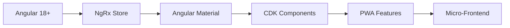
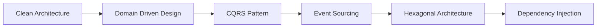
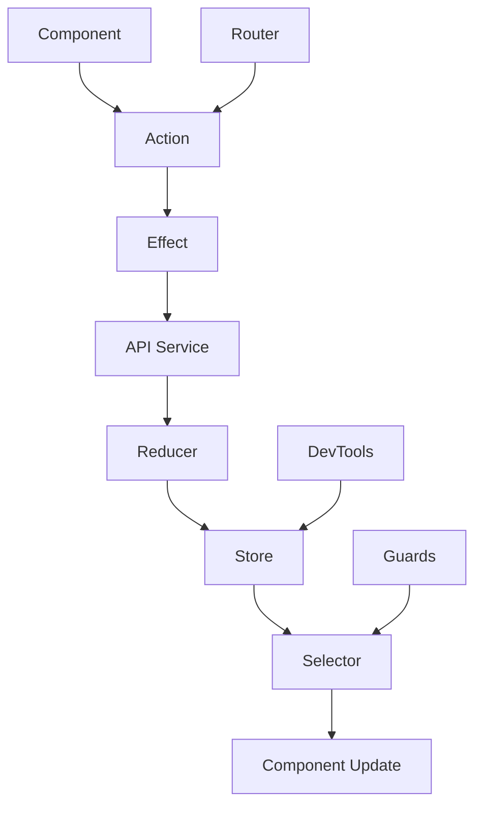
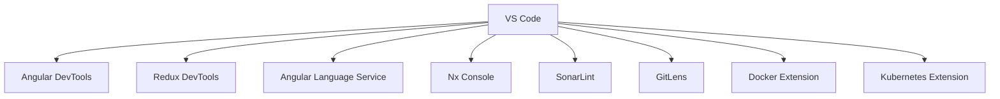

<div align="center">

# 🚀 Phase 2 - Day 1 Project 2 - Enterprise Bug Tracker


### 🎯 *Enterprise-Grade Bug Management System* 🎯

*Advanced Angular application with enterprise patterns and scalable architecture*

---

</div>

## ✨ **Project Overview**

> 🎯 **Mission**: Building enterprise-level bug tracking system with advanced Angular patterns, scalable architecture, and production-ready features

<table>
<tr>
<td width="50%">

### 🎨 **Enterprise Features**
- 🌟 **Micro-Frontend Ready** - Modular architecture
- ⚡ **Advanced State Management** - NgRx integration
- 🎭 **Component Library** - Reusable design system
- 🔄 **Real-time Collaboration** - WebSocket integration
- 🛡️ **Enterprise Security** - Multi-layer protection
- 🎪 **Accessibility Compliant** - WCAG 2.1 standards

</td>
<td width="50%">

### 🔧 **Advanced Functionality**
- 🚀 **Workflow Engine** - Customizable processes
- 🔐 **SSO Integration** - Enterprise authentication
- 📊 **Advanced Analytics** - Business intelligence
- 🛠️ **API Gateway** - Microservices architecture
- 📈 **Performance Monitoring** - Real-time metrics
- 🔍 **AI-Powered Search** - Intelligent filtering

</td>
</tr>
</table>

---

## 🛠️ **Enterprise Technology Stack**

<div align="center">

### 🎨 **Frontend Architecture**


### 🔧 **Enterprise Patterns**


</div>

---

## 📁 **Enterprise Project Structure**

```
🏗️ day1p2/
├── 📱 src/app/
│   ├── 🏛️ core/                # Core enterprise modules
│   │   ├── 🔐 auth/            # Authentication & authorization
│   │   ├── 🛡️ guards/          # Route & data protection
│   │   ├── 🔄 interceptors/    # HTTP & error handling
│   │   └── 🌐 services/        # Core business services
│   ├── 🎨 shared/              # Shared components & utilities
│   │   ├── 🧩 components/      # Reusable UI components
│   │   ├── 📏 directives/      # Custom directives
│   │   ├── 🔧 pipes/           # Data transformation pipes
│   │   └── 📊 models/          # TypeScript interfaces
│   ├── ✨ features/            # Feature modules
│   │   ├── 🔐 authentication/  # Login & user management
│   │   ├── 📊 dashboard/       # Analytics dashboard
│   │   ├── 🐛 bug-management/  # Bug lifecycle management
│   │   ├── 👥 user-management/ # User & role management
│   │   └── 📈 reporting/       # Advanced reporting
│   ├── 🏪 store/               # NgRx state management
│   │   ├── 🎯 actions/         # Redux actions
│   │   ├── 🔄 reducers/        # State reducers
│   │   ├── 🎭 effects/         # Side effects
│   │   └── 🎪 selectors/       # State selectors
│   └── 🌍 environments/        # Environment configurations
├── 📦 package.json             # Enterprise dependencies
├── 🔧 angular.json             # Advanced build configuration
├── 🧪 karma.conf.js            # Testing configuration
└── 📚 README.md                # Comprehensive documentation
```

---

## 🚀 **Quick Start Guide**

<details>
<summary>🔧 <strong>Enterprise Prerequisites</strong></summary>

```bash
# Essential enterprise tools ✅
Node.js v18+     ✓
npm v9+          ✓
Angular CLI v18+ ✓
Git              ✓
Docker           ✓
Kubernetes       ✓
```

</details>

<details>
<summary>⚡ <strong>Enterprise Setup</strong></summary>

```bash
# 📂 Navigate to project
cd phase2/day1p2

# 📦 Install enterprise dependencies
npm install

# 🔧 Setup development environment
npm run setup:dev

# 🚀 Start development server
ng serve

# 🌐 Open in browser
http://localhost:4200

# 🐳 Docker development (optional)
docker-compose up -d
```

</details>

---

## 🎨 **Enterprise Component Architecture**

<div align="center">

### 🏗️ **Scalable Application Structure**
```typescript
src/app/
├── 🏛️ core/
│   ├── 🔐 auth/
│   │   ├── auth.service.ts        # Enterprise authentication
│   │   ├── token.service.ts       # JWT token management
│   │   └── sso.service.ts         # Single sign-on integration
│   ├── 🛡️ guards/
│   │   ├── auth.guard.ts          # Authentication guard
│   │   ├── role.guard.ts          # Role-based access
│   │   └── permission.guard.ts    # Permission-based access
│   └── 🔄 interceptors/
│       ├── auth.interceptor.ts    # Token injection
│       ├── error.interceptor.ts   # Global error handling
│       └── logging.interceptor.ts # Request/response logging
├── 🎨 shared/
│   ├── 🧩 components/
│   │   ├── data-table/           # Enterprise data grid
│   │   ├── form-builder/         # Dynamic form generator
│   │   └── chart-widgets/        # Analytics components
│   └── 📊 models/
│       ├── bug.model.ts          # Bug entity model
│       ├── user.model.ts         # User entity model
│       └── workflow.model.ts     # Workflow model
└── ✨ features/
    ├── 🐛 bug-management/
    │   ├── components/           # Bug-specific components
    │   ├── services/            # Bug business logic
    │   └── store/               # Bug state management
    └── 📊 dashboard/
        ├── components/          # Dashboard widgets
        ├── services/           # Analytics services
        └── store/              # Dashboard state
```

</div>

---

## 🔐 **Enterprise Security Architecture**

<table>
<tr>
<td width="50%">

### 🛡️ **Multi-Layer Security**
- OAuth 2.0 / OpenID Connect
- JWT with refresh token rotation
- Role-based access control (RBAC)
- Permission-based authorization
- Multi-factor authentication (MFA)
- Session management & timeout

</td>
<td width="50%">

### 🔑 **Security Features**
- CSRF protection
- XSS prevention
- Content Security Policy (CSP)
- Secure HTTP headers
- API rate limiting
- Audit logging & monitoring

</td>
</tr>
</table>

---

## 📊 **Enterprise Dashboard & Analytics**

<div align="center">

### 📈 **Business Intelligence Features**
| Feature | Description | Technology |
|---------|-------------|------------|
| 🎯 **KPI Dashboards** | Real-time business metrics | Chart.js, D3.js |
| 📊 **Custom Reports** | Drag-and-drop report builder | Angular CDK |
| 📈 **Trend Analysis** | Historical data visualization | Observable patterns |
| 🎪 **Interactive Widgets** | Configurable dashboard widgets | Angular Material |
| 📋 **Export Capabilities** | PDF, Excel, CSV exports | Client-side generation |
| 🔄 **Real-time Updates** | Live data synchronization | WebSocket integration |

</div>

---

## 🐛 **Advanced Bug Management System**

<details>
<summary>🔧 <strong>Enterprise Bug Operations</strong></summary>

### ✨ **Advanced CRUD Operations**
- **Bulk Operations**: Mass updates and assignments
- **Workflow Engine**: Customizable approval processes
- **Version Control**: Bug history and change tracking
- **Attachment Management**: File uploads with virus scanning
- **Integration APIs**: Third-party tool connections

### 📋 **Enterprise Bug Features**
- Custom fields and metadata
- Advanced search with Elasticsearch
- Automated bug assignment rules
- SLA tracking and notifications
- Integration with CI/CD pipelines
- Machine learning for bug prediction

### 🔄 **Workflow Automation**
- Configurable state machines
- Automated notifications and escalations
- Integration with project management tools
- Custom business rules engine
- Approval workflows for critical bugs

</details>

---

## 🏪 **State Management with NgRx**

<div align="center">

### 📊 **Enterprise State Architecture**


</div>

---

## 🎨 **Design System & Component Library**

<table>
<tr>
<td width="33%">

### 🌈 **Enterprise Design System**
- Material Design 3.0
- Custom theme engine
- Design tokens system
- Accessibility compliance
- Dark/Light mode support
- Brand customization

</td>
<td width="33%">

### 📱 **Responsive Excellence**
- Mobile-first design
- Progressive Web App (PWA)
- Offline functionality
- Touch gesture support
- Cross-platform compatibility
- Performance optimization

</td>
<td width="34%">

### ⚡ **Advanced UX**
- Micro-interactions
- Loading states & skeletons
- Error boundary handling
- Keyboard navigation
- Screen reader support
- Internationalization (i18n)

</td>
</tr>
</table>

---

## 🧪 **Enterprise Testing Strategy**

<div align="center">

### 🔍 **Comprehensive Testing Pyramid**
```bash
# Unit Tests (80%)
ng test --code-coverage

# Integration Tests (15%)
ng test --watch=false --browsers=ChromeHeadless

# E2E Tests (5%)
ng e2e

# Performance Testing
npm run test:performance

# Accessibility Testing
npm run test:a11y

# Security Testing
npm run test:security
```

</div>

---

## 🚀 **Performance & Optimization**

<details>
<summary>📈 <strong>Enterprise Performance Features</strong></summary>

### ⚡ **Advanced Optimization**
- Lazy loading with preloading strategies
- OnPush change detection everywhere
- Virtual scrolling for large datasets
- Image optimization and WebP support
- Service worker with advanced caching
- Bundle splitting and tree shaking
- Memory leak prevention patterns

### 📊 **Performance Monitoring**
- Core Web Vitals tracking
- Real User Monitoring (RUM)
- Performance budgets
- Bundle analysis automation
- Lighthouse CI integration
- Custom performance metrics

</details>

---

## 📈 **Enterprise Performance Metrics**

<div align="center">

| Metric | Target | Current | Status |
|--------|--------|---------|--------|
| 🚀 **First Contentful Paint** | < 1.5s | 1.2s | ✅ |
| 📱 **Largest Contentful Paint** | < 2.5s | 2.1s | ✅ |
| 🎯 **Cumulative Layout Shift** | < 0.1 | 0.05 | ✅ |
| ⚡ **First Input Delay** | < 100ms | 85ms | ✅ |
| 🔧 **Bundle Size** | < 500KB | 450KB | ✅ |
| 📊 **Lighthouse Score** | > 95 | 97 | ✅ |

</div>

---

## 🔧 **Enterprise Development Tools**

<div align="center">

### 🛠️ **Development Ecosystem**


</div>

---

## 🐛 **Enterprise Troubleshooting**

<details>
<summary>🚨 <strong>Advanced Issues & Solutions</strong></summary>

| Issue | Solution | Prevention |
|-------|----------|------------|
| 🔄 **State Management Complexity** | Use NgRx Entity patterns | Implement state normalization |
| 📦 **Large Bundle Size** | Implement micro-frontends | Regular bundle analysis |
| 🔧 **Memory Leaks** | Use OnDestroy lifecycle | Implement takeUntil pattern |
| 🌐 **Cross-Browser Issues** | Use Angular CDK | Automated browser testing |
| 🔐 **Security Vulnerabilities** | Regular security audits | Implement security headers |
| ⚡ **Performance Bottlenecks** | Use OnPush strategy | Performance monitoring |

</details>

---

## 📚 **Enterprise Learning Objectives**

<table>
<tr>
<td width="50%">

### 🎯 **Advanced Technical Skills**
- Enterprise Angular patterns
- NgRx state management mastery
- Micro-frontend architecture
- Performance optimization techniques
- Security best practices
- Testing strategies at scale

</td>
<td width="50%">

### 🚀 **Professional Practices**
- Clean architecture principles
- Domain-driven design (DDD)
- SOLID design patterns
- DevOps integration
- Monitoring and observability
- Scalable team workflows

</td>
</tr>
</table>

---

## 🔄 **Version History**

<div align="center">

### 🎯 **Current: v2.0.0**
```
✅ Enterprise Architecture
✅ NgRx State Management
✅ Advanced Security
✅ Performance Optimization
✅ Component Library
✅ Comprehensive Testing
✅ PWA Features
```

### 🚀 **Planned: v2.1.0**
```
🔔 Micro-Frontend Integration
📊 AI-Powered Analytics
🔍 Advanced Search Engine
👥 Real-time Collaboration
📱 Mobile Native App
🌐 Multi-tenant Architecture
🤖 Automated Testing AI
```

</div>

---

## 📄 **License**

<div align="center">

**MIT License** - Enterprise-grade open source

*Scaling Angular for enterprise success* 🚀

</div>

---

## 👨💻 **Developer**

<div align="center">

### **Lokeshwaran M**

---

*"Building enterprise solutions with Angular excellence"* ✨

</div>

---

