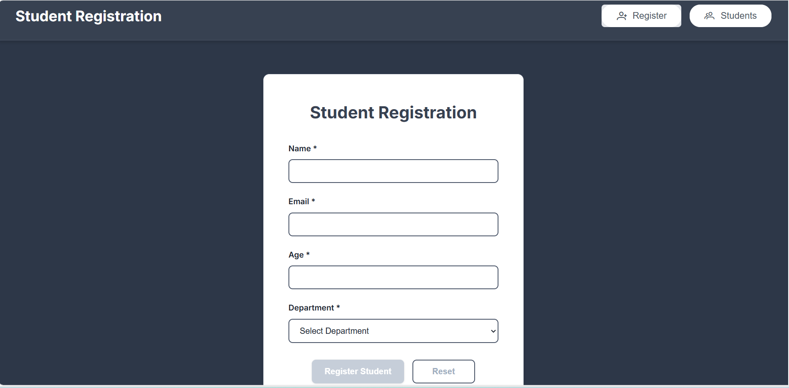
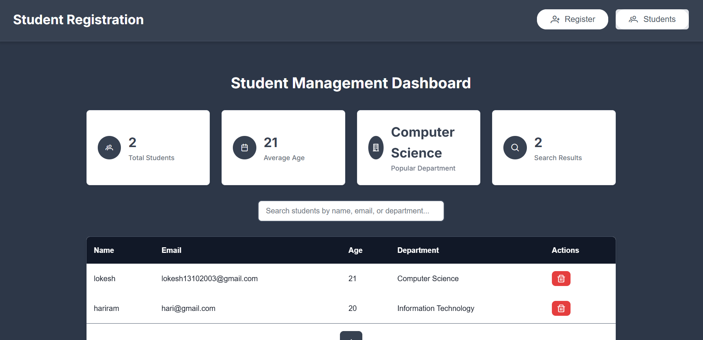
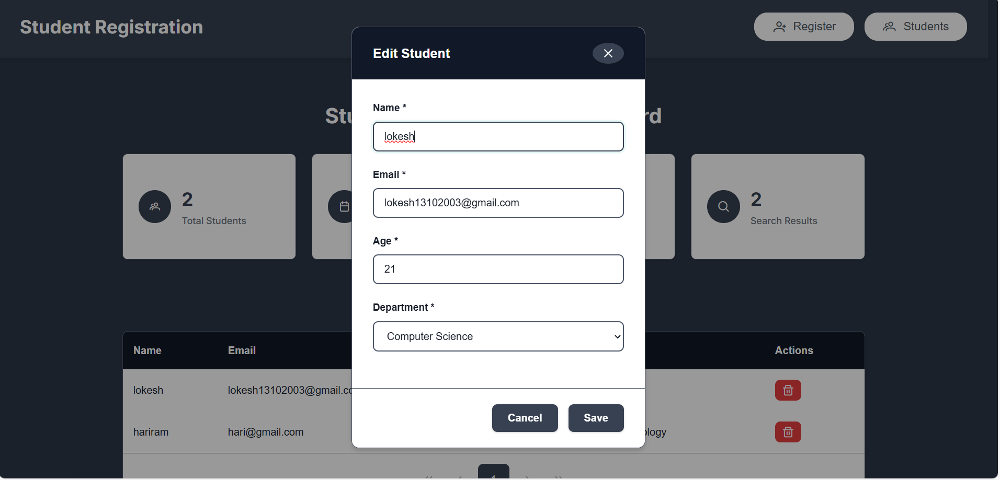
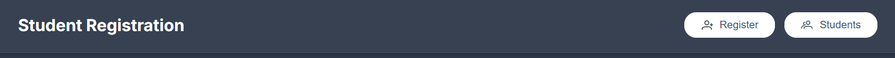
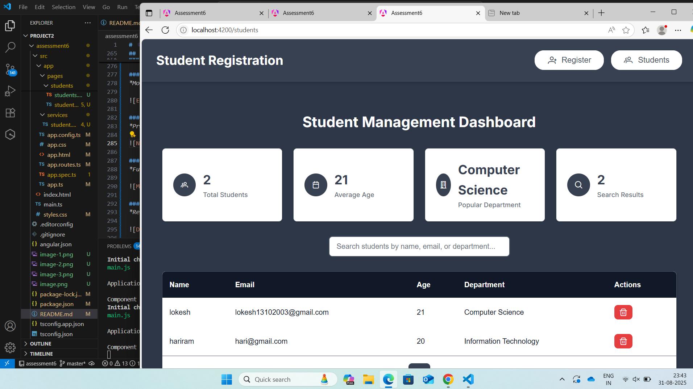
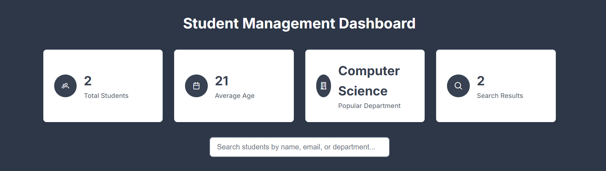
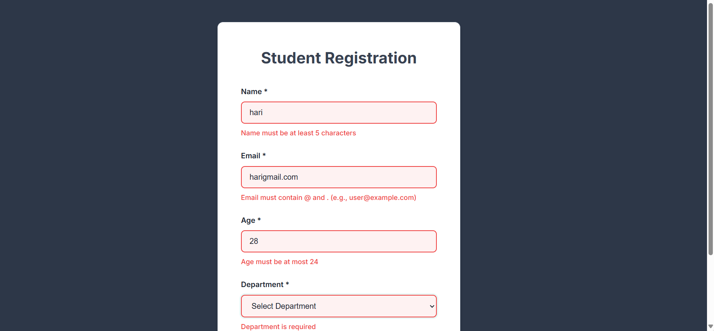

# 🎓 Student Portal - Modern Angular Application

<div align="center">


**A comprehensive student management system built with Angular 20 and PrimeNG**

[Features](#-features) • [Demo](#-screenshots) • [Installation](#-installation) • [Usage](#-usage) • [API](#-api-reference)

</div>

---

## 📋 Table of Contents

- [Overview](#-overview)
- [Features](#-features)
- [Technology Stack](#-technology-stack)
- [Architecture](#-architecture)
- [Installation](#-installation)
- [Usage](#-usage)
- [Screenshots](#-screenshots)
- [API Reference](#-api-reference)
- [Project Structure](#-project-structure)
- [Development](#-development)
- [Testing](#-testing)
- [Deployment](#-deployment)
- [Contributing](#-contributing)
- [License](#-license)

---

## 🌟 Overview

The **Student Portal** is a modern, responsive web application designed for educational institutions to manage student registrations and data efficiently. Built with Angular 20 and PrimeNG, it offers a professional user interface with comprehensive student management capabilities.

### 🎯 Purpose

This application serves as a complete solution for:
- **Student Registration Management**
- **Data Visualization & Analytics**
- **Search & Filter Operations**
- **CRUD Operations with Validation**
- **Responsive Design for All Devices**

---

## ✨ Features

### 🔐 Core Functionality

- **📝 Student Registration**
  - Comprehensive form with real-time validation
  - Age restrictions (17-24 years)
  - Name length validation (5-50 characters)
  - Advanced email validation with @ and . requirements
  - Department selection from predefined options

- **📊 Student Dashboard**
  - Interactive statistics cards
  - Total student count
  - Average age calculation
  - Most popular department analysis
  - Real-time search result counter

- **🔍 Advanced Search & Filter**
  - Real-time search across name, email, and department
  - Instant results with no page refresh
  - Search result highlighting
  - Filter persistence during navigation

- **📋 Data Management**
  - Professional PrimeNG DataTable
  - Pagination support (10 records per page)
  - Row selection and editing
  - Delete functionality with confirmation
  - Sortable columns

### 🎨 User Interface

- **🎭 Modern Design**
  - Charcoal grey theme with white accents
  - Professional color scheme
  - Consistent typography using Inter font
  - Responsive grid layouts

- **📱 Responsive Design**
  - Mobile-first approachN
  - Adaptive layouts for all screen sizes
  - Touch-friendly interactions
  - Optimized for tablets and desktops

- **🚀 User Experience**
  - Smooth transitions and interactions
  - Intuitive navigation with PrimeNG Menubar
  - Form validation with clear error messages
  - Loading states and feedback

### 🔧 Technical Features

- **💾 Data Persistence**
  - LocalStorage integration
  - Automatic data saving
  - Session persistence
  - Data recovery on page refresh

- **🛡️ Form Validation**
  - Angular Reactive Forms
  - Real-time validation feedback
  - Custom validators
  - Error message localization

- **🎯 State Management**
  - RxJS Observables
  - Service-based architecture
  - Reactive data flow
  - Memory leak prevention

---

## 🛠️ Technology Stack

### Frontend Framework
- **Angular 20.2.0** - Latest Angular framework with standalone components
- **TypeScript 5.0** - Type-safe JavaScript development
- **RxJS** - Reactive programming with Observables

### UI Components & Styling
- **PrimeNG 17** - Professional Angular UI component library
- **PrimeIcons** - Comprehensive icon set
- **CSS3** - Modern styling with custom properties
- **Inter Font** - Professional typography

### Development Tools
- **Angular CLI** - Command-line interface for Angular
- **Node.js** - JavaScript runtime environment
- **npm** - Package manager

### Browser Support
- ✅ Chrome 90+
- ✅ Firefox 88+
- ✅ Safari 14+
- ✅ Edge 90+

---

## 🏗️ Architecture

### Component Structure
```
src/
├── app/
│   ├── components/          # Reusable UI components
│   ├── pages/              # Feature pages
│   │   ├── register/       # Student registration
│   │   └── students/       # Student management
│   ├── services/           # Business logic services
│   └── models/             # TypeScript interfaces
```

### Design Patterns
- **Reactive Forms** - Form handling and validation
- **Observer Pattern** - Data flow management
- **Service Layer** - Business logic separation
- **Component Communication** - Parent-child data flow

### Data Flow
1. **User Input** → Component
2. **Component** → Service
3. **Service** → LocalStorage
4. **Service** → Observable Stream
5. **Observable** → Component Update

---

## 🚀 Installation

### Prerequisites
- Node.js 18.0 or higher
- npm 9.0 or higher
- Angular CLI 20.0 or higher

### Quick Start

1. **Clone the repository**
   ```bash
   git clone https://github.com/your-username/student-portal.git
   cd student-portal
   ```

2. **Install dependencies**
   ```bash
   npm install
   ```

3. **Start development server**
   ```bash
   ng serve
   ```

4. **Open in browser**
   ```
   http://localhost:4200
   ```

### Production Build

```bash
# Build for production
ng build --prod

# Serve production build
ng serve --prod
```

---

## 📖 Usage

### Student Registration

1. **Navigate to Register page**
   - Click "Register" in the navigation menu
   - Fill out the registration form

2. **Form Validation**
   - Name: 5-50 characters required
   - Email: Must contain @ and . (e.g., user@example.com)
   - Age: Must be between 17-24 years
   - Department: Select from dropdown

3. **Submit Registration**
   - Click "Register Student" button
   - Success message will appear
   - Form will reset for next entry

### Student Management

1. **View Dashboard**
   - Navigate to "Students" page
   - View statistics cards at the top
   - Browse student list in the table

2. **Search Students**
   - Use search bar to filter by name, email, or department
   - Results update in real-time
   - Search counter shows filtered results

3. **Edit Student**
   - Click on any student row
   - Edit dialog opens with current data
   - Make changes and click "Save"

4. **Delete Student**
   - Click delete button (trash icon) in student row
   - Confirm deletion in popup dialog
   - Student is permanently removed

---

## 📸 Screenshots

### 1. Student Registration Page
*Professional registration form with real-time validation, charcoal theme, and comprehensive field validation*



### 2. Student List Page (Data Table)
*Interactive PrimeNG DataTable with statistics dashboard, search functionality, and CRUD operations*



### 3. Edit Student Dialog
*Modal dialog for editing student information with form validation and professional styling*



### 4. Navigation & Routing
*Professional menubar with ellipse-shaped navigation buttons and routing between pages*



### 5. Mobile Responsive View
*Fully responsive design optimized for mobile devices with adaptive layouts*



### 6. Dashboard Statistics Cards
*Real-time analytics showing total students, average age, popular department, and search results*



### 7. Form Validation & Error States
*Comprehensive validation system with real-time error messages and user feedback*

(image-7.png)

---

## 📚 API Reference

### StudentService

#### Methods

```typescript
// Get all students
getStudents(): Student[]

// Add new student
addStudent(student: Omit<Student, 'id'>): void

// Update existing student
updateStudent(id: number, student: Partial<Student>): void

// Delete student
deleteStudent(id: number): void

// Get student by ID
getStudent(id: number): Student | undefined
```

#### Observables

```typescript
// Students data stream
students$: Observable<Student[]>
```

### Student Interface

```typescript
interface Student {
  id: number;
  name: string;
  email: string;
  age: number;
  department: string;
}
```

### Form Validation Rules

| Field | Rules | Error Messages |
|-------|-------|----------------|
| Name | Required, 5-50 chars | "Name is required", "Name must be 5-50 characters" |
| Email | Required, pattern | "Email is required", "Must contain @ and ." |
| Age | Required, 17-24 | "Age is required", "Age must be 17-24" |
| Department | Required | "Department is required" |

---

## 📁 Project Structure

```
student-portal/
├── src/
│   ├── app/
│   │   ├── pages/
│   │   │   ├── register/
│   │   │   │   ├── register.component.ts
│   │   │   │   ├── register.component.html
│   │   │   │   └── register.component.css
│   │   │   └── students/
│   │   │       ├── students.component.ts
│   │   │       ├── students.component.html
│   │   │       └── students.component.css
│   │   ├── services/
│   │   │   └── student.service.ts
│   │   ├── app.component.ts
│   │   ├── app.component.html
│   │   ├── app.component.css
│   │   └── app.routes.ts
│   ├── styles.css
│   └── main.ts
├── angular.json
├── package.json
├── tsconfig.json
└── README.md
```

---

## 🔧 Development

### Code Style
- **ESLint** - Code linting and formatting
- **Prettier** - Code formatting
- **TypeScript strict mode** - Type safety

### Development Commands

```bash
# Start development server
ng serve

# Run tests
ng test

# Run e2e tests
ng e2e

# Build for production
ng build --prod

# Analyze bundle size
ng build --stats-json
npx webpack-bundle-analyzer dist/stats.json
```

### Environment Configuration

```typescript
// src/environments/environment.ts
export const environment = {
  production: false,
  apiUrl: 'http://localhost:3000/api'
};
```

---

## 🧪 Testing

### Unit Tests
- **Jasmine** - Testing framework
- **Karma** - Test runner
- **Coverage reports** - Code coverage analysis

### Test Commands
```bash
# Run unit tests
ng test

# Run tests with coverage
ng test --code-coverage

# Run tests in CI mode
ng test --watch=false --browsers=ChromeHeadless
```

### E2E Tests
- **Protractor** - End-to-end testing
- **Cypress** - Modern e2e testing (alternative)

---

## 🚀 Deployment

### Build Process
1. **Production Build**
   ```bash
   ng build --prod
   ```

2. **Deploy to Static Hosting**
   - Netlify
   - Vercel
   - GitHub Pages
   - AWS S3

### Environment Variables
```bash
# Production environment
NODE_ENV=production
API_URL=https://api.studentportal.com
```

### Performance Optimization
- **Lazy Loading** - Route-based code splitting
- **OnPush Strategy** - Change detection optimization
- **Tree Shaking** - Dead code elimination
- **Minification** - Code compression

---

## 🤝 Contributing

We welcome contributions! Please follow these guidelines:

### Development Workflow
1. **Fork** the repository
2. **Create** a feature branch
3. **Make** your changes
4. **Test** thoroughly
5. **Submit** a pull request

### Code Standards
- Follow Angular style guide
- Write unit tests for new features
- Update documentation
- Use conventional commit messages

### Pull Request Process
1. Update README.md with details of changes
2. Increase version numbers following SemVer
3. Ensure all tests pass
4. Request review from maintainers

---

## 📄 License

This project is licensed under the MIT License - see the [LICENSE](LICENSE) file for details.

### MIT License Summary
- ✅ Commercial use
- ✅ Modification
- ✅ Distribution
- ✅ Private use
- ❌ Liability
- ❌ Warranty

---

## 🙏 Acknowledgments

- **Angular Team** - For the amazing framework
- **PrimeNG Team** - For the comprehensive UI components
- **Community Contributors** - For feedback and suggestions
- **Educational Institutions** - For requirements and testing

---

## 👨‍💻 Developer

### About the Developer

**Name**: Lokeshwaran M
**Role**: Engineering Trainee - Software   
**Specialization**: Angular, TypeScript, PrimeNG, Responsive Design

### Technical Expertise
- **Frontend**: Angular 20, TypeScript, RxJS, PrimeNG, CSS3, HTML5
- **Backend**: Node.js, Express.js, MongoDB, PostgreSQL
- **Tools**: Angular CLI, Git, VS Code, npm, Webpack
- **Design**: Responsive Design, UI/UX, Material Design, Professional Themes

### Development Philosophy
- **Clean Code**: Writing maintainable and readable code
- **User Experience**: Prioritizing intuitive and accessible interfaces
- **Performance**: Optimizing for speed and efficiency
- **Best Practices**: Following Angular style guide and industry standards

### Project Highlights
- **Modern Architecture**: Implemented standalone components and latest Angular features
- **Professional UI**: Created charcoal grey theme with white accents for corporate appeal
- **Responsive Design**: Ensured seamless experience across all device sizes
- **Form Validation**: Built comprehensive validation system with real-time feedback
- **Data Management**: Integrated localStorage with reactive data flow
- **Performance**: Optimized bundle size and implemented lazy loading strategies

### Future Enhancements
- Backend API integration
- Advanced reporting features
- Export functionality (PDF, Excel)
- User authentication system
- Multi-language support
- Dark/Light theme toggle

---
